# 安装指南 / Installation Guide

本页面详细介绍了如何配置运行本项目所需的开发环境、安装依赖、启动服务等步骤。

---

## 1. 下载一些必要的软件 / Download necessary software


<details>
<summary><strong>🧱 Visual Studio 安装与组件配置 (C++环境，UE需要)</strong></summary>

参考配置链接：[为虚幻引擎C++项目设置Visual Studio开发环境](https://dev.epicgames.com/documentation/zh-cn/unreal-engine/setting-up-visual-studio-development-environment-for-cplusplus-projects-in-unreal-engine?application_version=5.3)

<aside>
💡下载 Visual Studio 2022 Community 版
</aside>

下载地址：[Visual Studio 2022 Community 版](https://visualstudio.microsoft.com/zh-hans/vs/community/)

选择Community即可


在安装设置里面选择安装路径

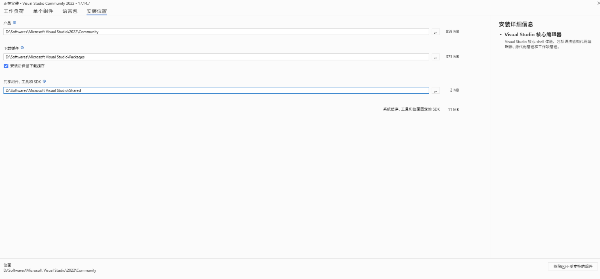

工作负荷中，勾选这些必要的组件，一共四个

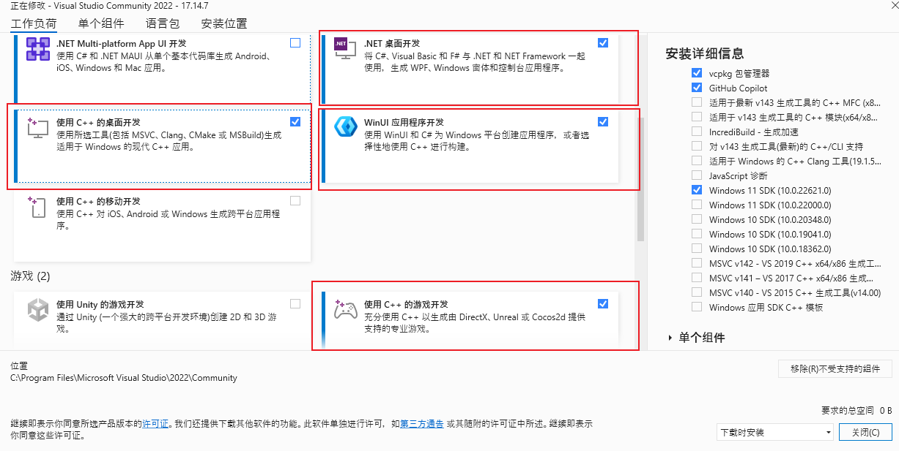

其中`使用C++的桌面开发`的安装详细信息这里，要选择Windows 11 SDK

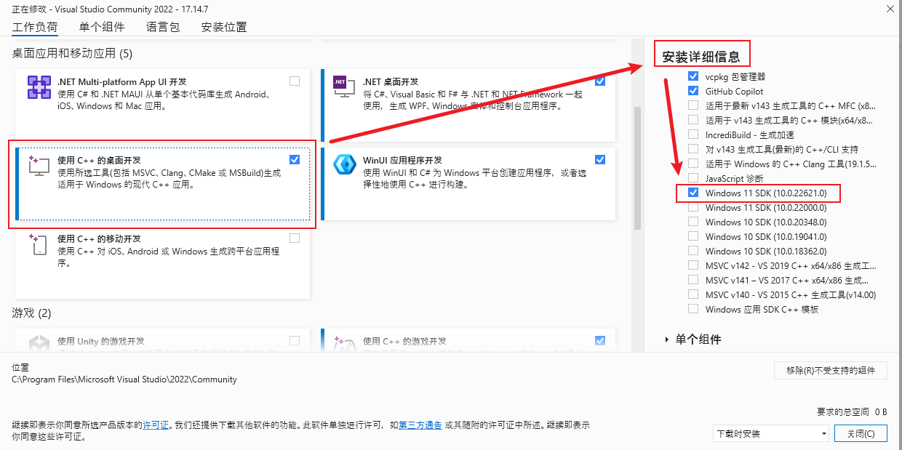

在单个组件中，搜索`unreal`，然后把所有的都勾选上。因为VS下载的目的就是用在UE上

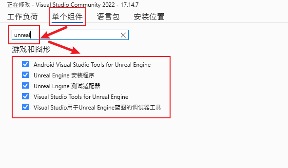

如果在使用过程中报错，可能是MSVC的错误，就把MSVC换成如下的

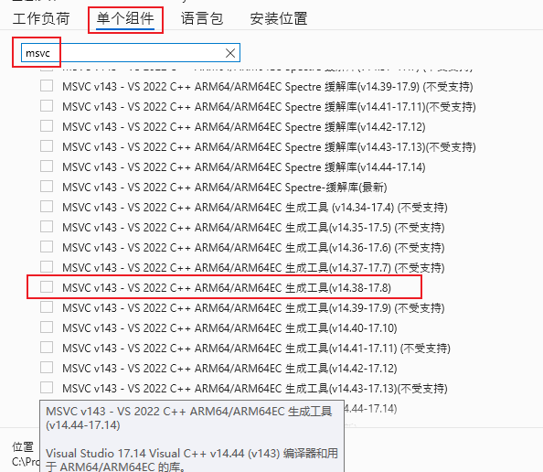
</details>

---

<details>
<summary><strong>🐍 Conda 环境配置 (Python环境， AI组件需要)</strong></summary>

这是教程博客：[一步步教你在 Windows 上轻松安装 Anaconda以及使用常用conda命令（超详细）](https://blog.csdn.net/Natsuago/article/details/143081283)

在这个网址下载：[Anaconda3-2025.06-0-Windows-x86_64.exe](https://repo.anaconda.com/archive/Anaconda3-2025.06-0-Windows-x86_64.exe)

例如：`Anaconda3-2025.06-0-Windows-x86_64.exe` 表示：

> Anaconda3：Anaconda 3.x 版本，支持 Python 3.x。
2025.06-0：表示此版本发布于 2025年 6 月，带有0 次更新。
Windows-x86_64：表示这是 Windows 系统的 64 位版本。
> 

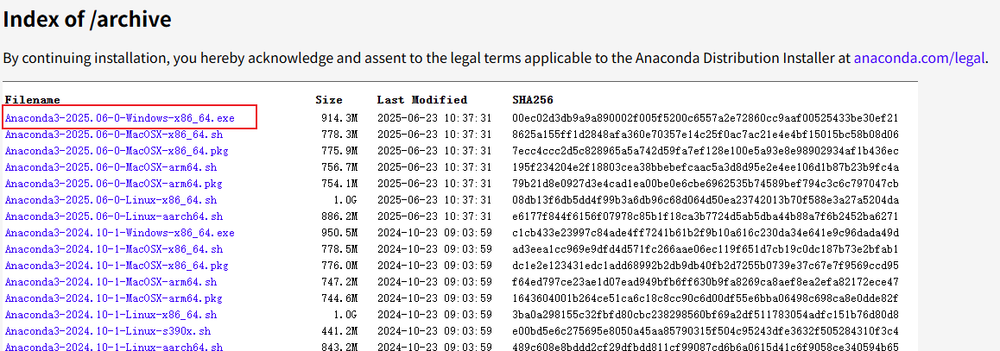

然后按照教程配置即可。

<aside>
💡再安装CUDA，本次安装CUDA12.6
</aside>

这是下载地址：[CUDA Toolkit 12.6 Downloads](https://developer.nvidia.com/cuda-12-6-0-download-archive?target_os=Windows&target_arch=x86_64&target_version=11&target_type=exe_local)

配置版本，然后点击下载就行

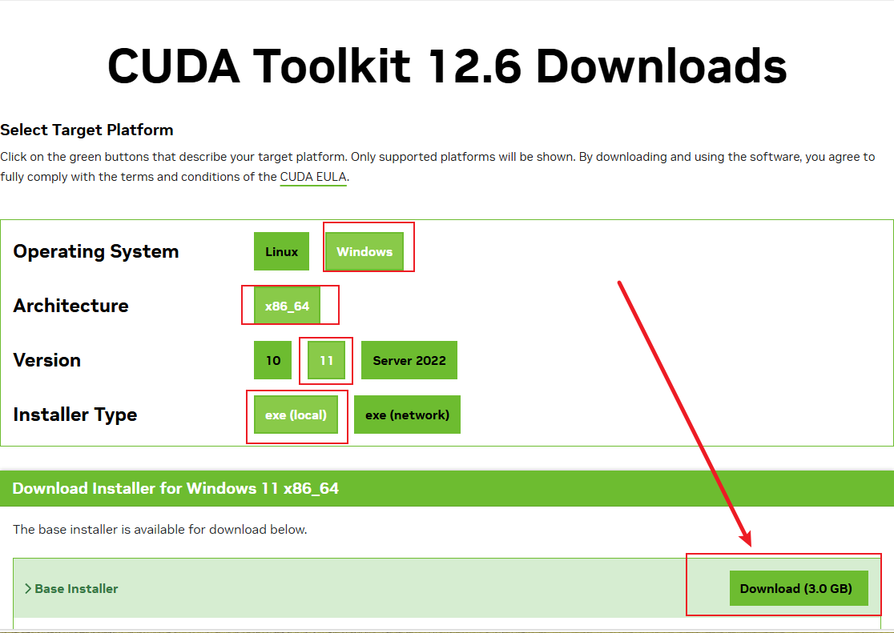


</details>

---


<details> <summary><strong>🎮 安装虚幻引擎 Unreal Engine</strong></summary>


以下是 Unreal Engine 5.3.2 的安装流程，适用于本项目中涉及的 3D 渲染模块。


### 1️⃣ 下载 Epic Games Launcher（启动器）

访问官网并下载安装 Epic Games Launcher：

🔗 [Unreal Engine 5.3.2 下载地址](https://www.unrealengine.com/zh-CN/download)

> Epic Games Launcher 是用于管理和安装 Unreal Engine 的官方启动程序。

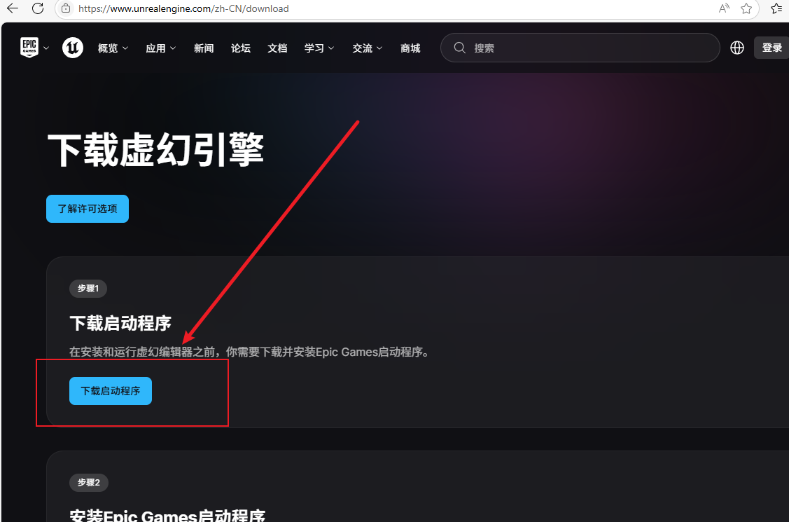

---

### 2️⃣ 安装并登录账户

完成安装后，运行 Epic Games Launcher，按照提示创建并登录账户。

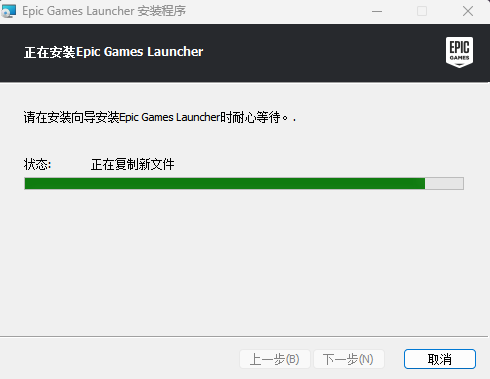

<p align="center">
  
</p>

---

### 3️⃣ 安装 Unreal Engine 5.3.2

登录成功后，进入左侧的 **“虚幻引擎”** 标签页，点击 “安装引擎”。

> 💡 **建议安装在非系统盘（如 D 盘）**，以避免 C 盘空间紧张和后续编译问题。

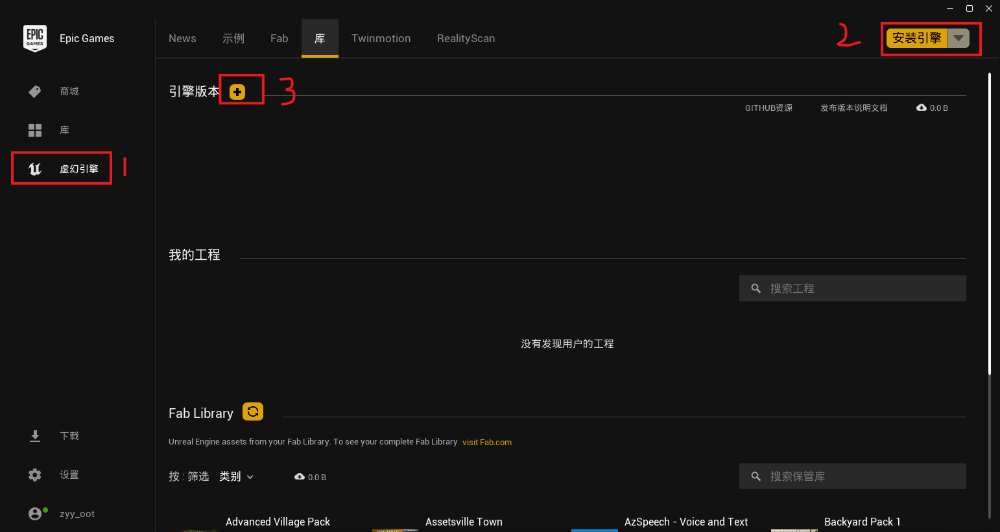

选择版本为 **5.3.2** 进行安装：

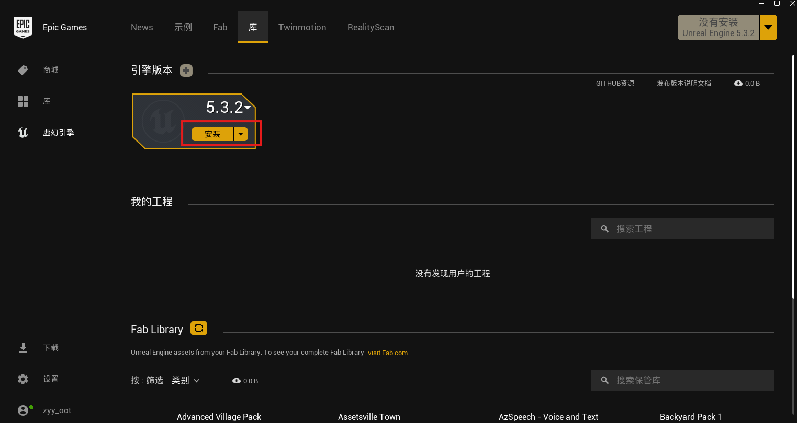


</details> 

---


<details>
 <summary><strong>💡 下载Audio2Face </strong></summary>


本指南将帮助你安装 NVIDIA Omniverse Audio2Face（2023.1.1）并导入驱动人脸的模型。包括官网下载安装方式和网盘便捷安装方式。


## 🚀 安装方式一：通过 Omniverse 官网下载安装

### 1️⃣ 下载 Omniverse Launcher

你可以从 NVIDIA 官网下载安装 Omniverse Launcher（它相当于是一个模块下载器）。

🔗 [官方下载地址](https://developer.nvidia.cn/omniverse?sortBy=developer_learning_library%2Fsort%2Ffeatured_in.omniverse%3Adesc%2Ctitle%3Aasc&hitsPerPage=6#section-%E5%BC%80%E5%A7%8B%E4%BD%BF%E7%94%A8)

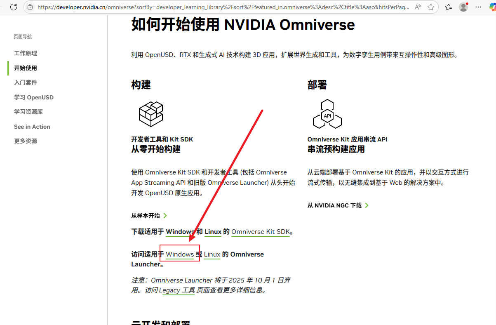

---

### 2️⃣ 注册并登录 NVIDIA 账户

完成下载后，注册并登录 NVIDIA 账户。

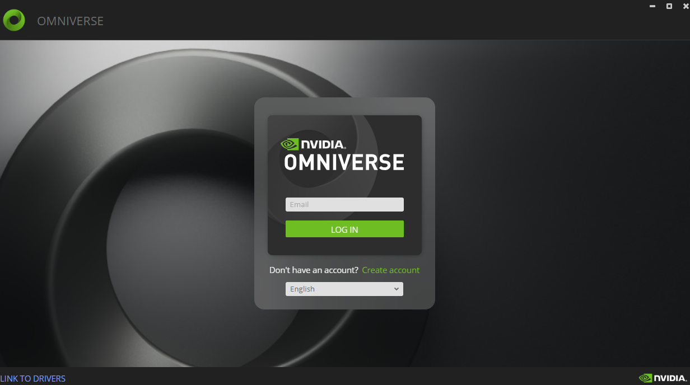

---

### 3️⃣ 安装 Audio2Face 2023.1.1

在 Launcher 内搜索并安装 **Audio2Face 2023.1.1**。

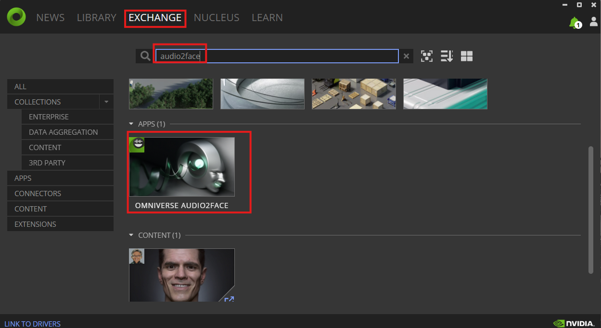
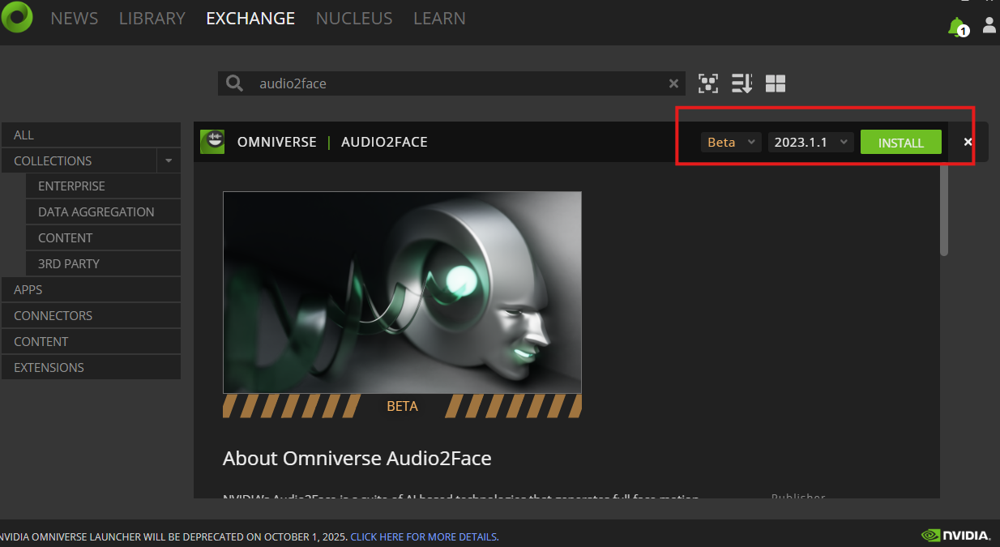

> 💡 安装过程可能较慢，建议连接稳定网络，部分公司网络可能受限，建议使用手机热点或代理。

---

### 4️⃣ 启动 Audio2Face

完成安装后，点击启动：

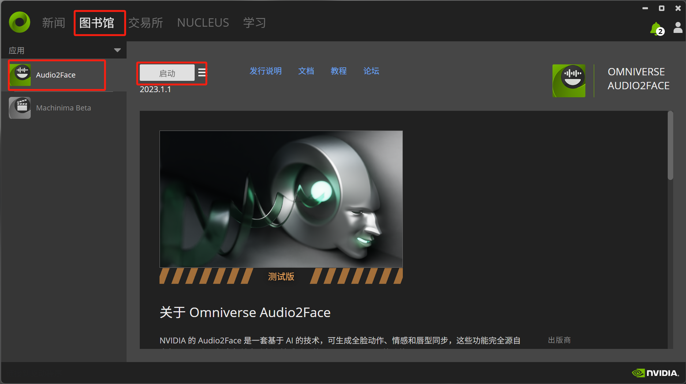

---

### 5️⃣ 导入三维人脸模型（`text.usd`）

从百度网盘下载以下模型文件：

🔗 链接：[百度网盘 text.usd](https://pan.baidu.com/s/1VtY0QrJz285kXtXhJ-rVog?pwd=e9w2)  
提取码：`e9w2`

将 `text.usd` 文件放入 Audio2Face 的工程目录中，打开 Audio2Face 后进入 **Example** 界面，定位到模型目录并双击导入。

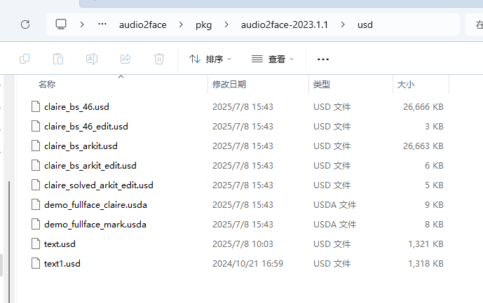

---


### 6️⃣ 成功启动后的界面

反复尝试导入模型，直到看到蓝色人脸即表示加载成功。

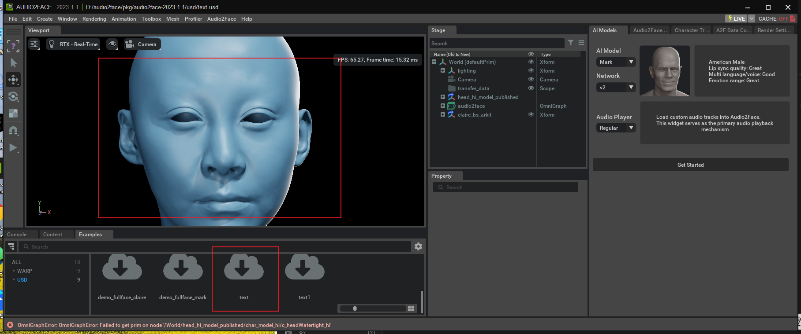

⚠️ 初次加载常见问题较多，可通过更换网络、多次重启尝试解决。

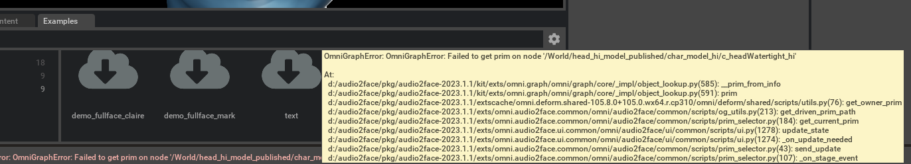

---

### 7️⃣ 解决常见网络问题

如果导入失败，多半是网络问题导致资源加载失败。建议：

- 使用代理或 VPN

## 🎁 安装方式二：一键安装（网盘便捷方式）

更推荐使用该方式，跳过下载 Launcher 和组件配置的繁琐过程。

### 1️⃣ 下载完整安装包

🔗 链接：[audio2face-2023.1.1.rar 百度网盘](https://pan.baidu.com/s/1fzZNYsHlLC1HUVol2z44ZA?pwd=j7uu)  
提取码：`j7uu`

---

### 2️⃣ 启动程序

解压后，双击 `audio2face.bat` 启动 Audio2Face。

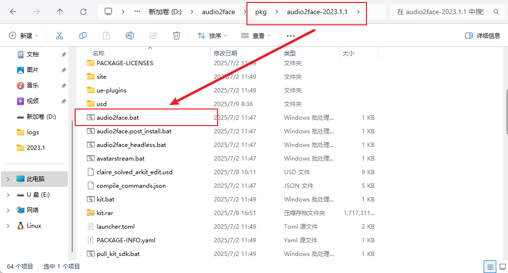

---

### 3️⃣ 正确启动后的控制台窗口

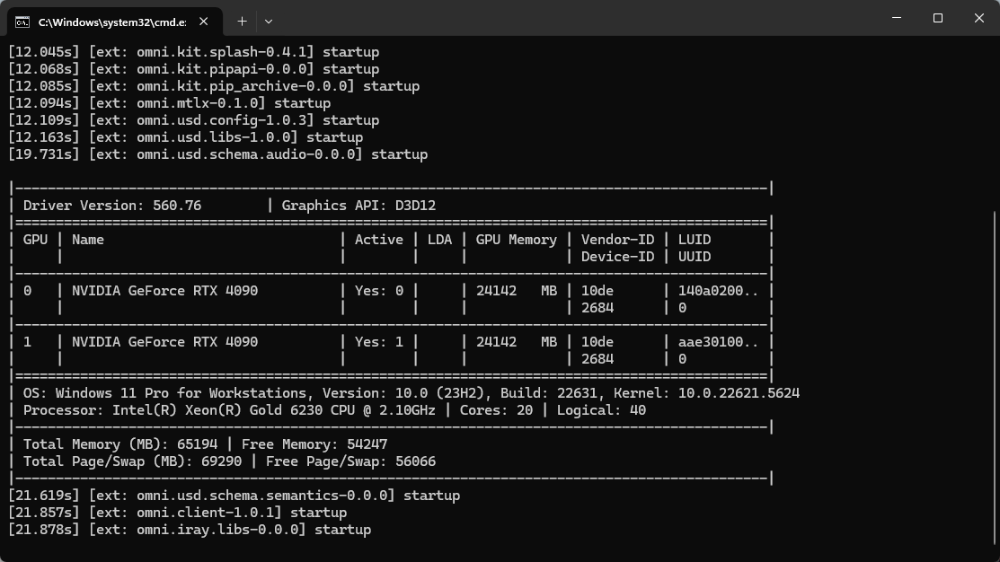

---

### 4️⃣ 界面加载成功，导入 `text.usd`

不要忘了仍需导入人脸模型 `text.usd`！


## ✅ 补充说明

- 蓝色人脸是 Audio2Face 的默认驱动面部模型，需要预设 viseme 数据
- 如果你使用的是一瑶预设的 `text.usd` 模型，请确保路径正确
- 网络不稳定是导致加载失败的主要原因，可多尝试几次或更换网络


🎉 至此，Audio2Face 安装与配置完成。如果你遇到任何问题，欢迎提交 Issue 或查看常见问题文档。


</details> 

---

## 2. 本机部署AI服务

<details>
<summary><strong>🖥️ Windows部署ASR (语音识别服务)</strong></summary>

### 1️⃣ 下载WSL
```bash
# 部署映像服务和管理工具
dism.exe /online /enable-feature /featurename:Microsoft-Windows-Subsystem-Linux /all /norestart
dism.exe /online /enable-feature /featurename:VirtualMachinePlatform /all /norestart
# 下载wsl
wsl --update
```
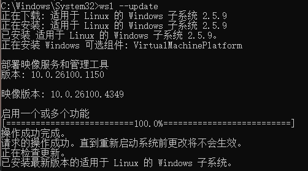

### 2️⃣ 下载Docker（Windows版本）

🔗 [Docker Desktop for Windows](https://www.docker.com/products/docker-desktop/)

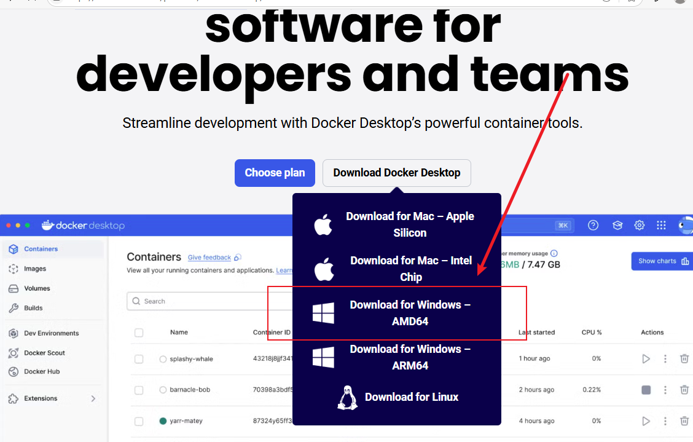

>双击下载的 Docker Desktop 安装包，按照屏幕上的指示进行操作。建议选择默认选项，包括启用 WSL 2 和 Hyper-V。（Docker是一个容器管理平台，需要基于WSL Linux系统）

### 3️⃣ 拉取FunASR镜像

```bash
docker pull registry.cn-hangzhou.aliyuncs.com/funasr_repo/funasr:funasr-runtime-sdk-online-cpu-0.1.12
```

启动容器，在非C盘的文件夹中打开终端，执行以下命令

```bash
docker run -p 10096:10095 --name FunASR -it --privileged=true -v $PWD/funasr-runtime-resources/models:/workspace/models registry.cn-hangzhou.aliyuncs.com/funasr_repo/funasr:funasr-runtime-sdk-online-cpu-0.1.12
```
> 创建容器，命名为FunASR，然后新建一个文件夹funasr-runtime-resources/models去映射容器里的/workspace/models目录，到时候在宿主机修改文件，容器内也会相应改变。

可能出现的问题：
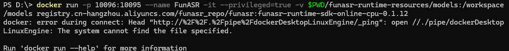
解决：打开Docker Destop

可能出现的问题：
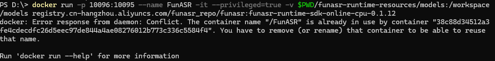
解决：输入 docker attach FunASR


创建完容器之后，就可以打开Docker Desktop看到FunASR了

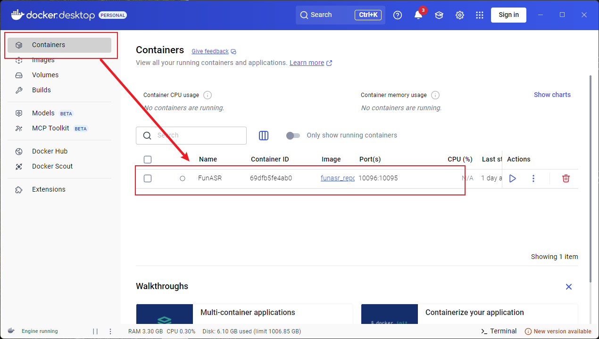

点击那个三角形启动按钮，然后点三个点，打开终端

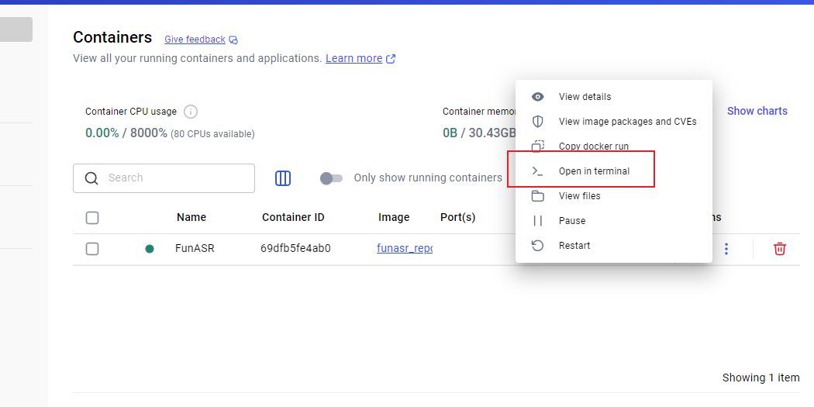

然后在终端里输入这段话，输入以下命令进行启动FunASR：
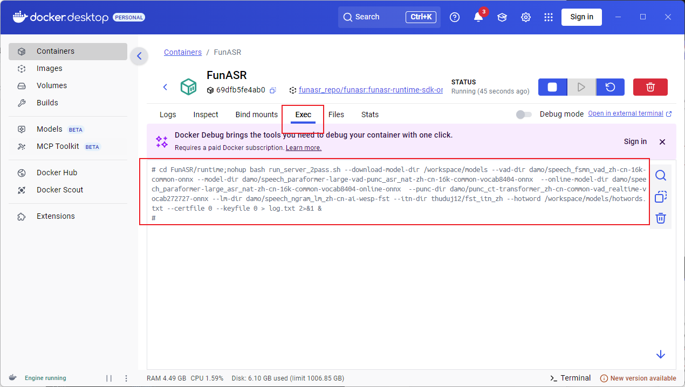

```bash
cd FunASR/runtime;nohup bash run_server_2pass.sh --download-model-dir /workspace/models --vad-dir damo/speech_fsmn_vad_zh-cn-16k-common-onnx --model-dir damo/speech_paraformer-large-vad-punc_asr_nat-zh-cn-16k-common-vocab8404-onnx  --online-model-dir damo/speech_paraformer-large_asr_nat-zh-cn-16k-common-vocab8404-online-onnx  --punc-dir damo/punc_ct-transformer_zh-cn-common-vad_realtime-vocab272727-onnx --lm-dir damo/speech_ngram_lm_zh-cn-ai-wesp-fst --itn-dir thuduj12/fst_itn_zh --hotword /workspace/models/hotwords.txt --certfile 0 --keyfile 0 > log.txt 2>&1 &

```
容器使用率出现之后，说明容器就启动成功了
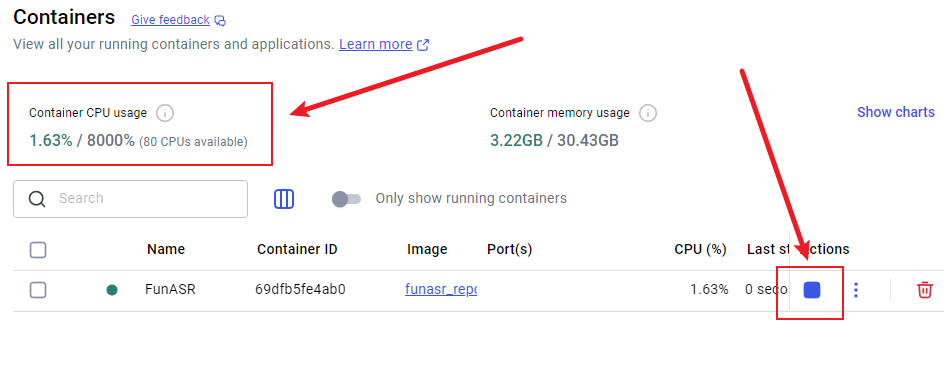

</details> 

---

<details>
<summary><strong>🚧 Windows部署MeloTTS (语音合成服务)</strong></summary>

可以直接去GitHub工程配置：[MeloTTS Github](https://github.com/myshell-ai/MeloTTS.git)

也可以通过网盘分享的文件：MeloTTS-main.7z
链接: https://pan.baidu.com/s/10CXsRh9qj5q-VJKayBRJvg?pwd=1qwb 提取码: 1qwb

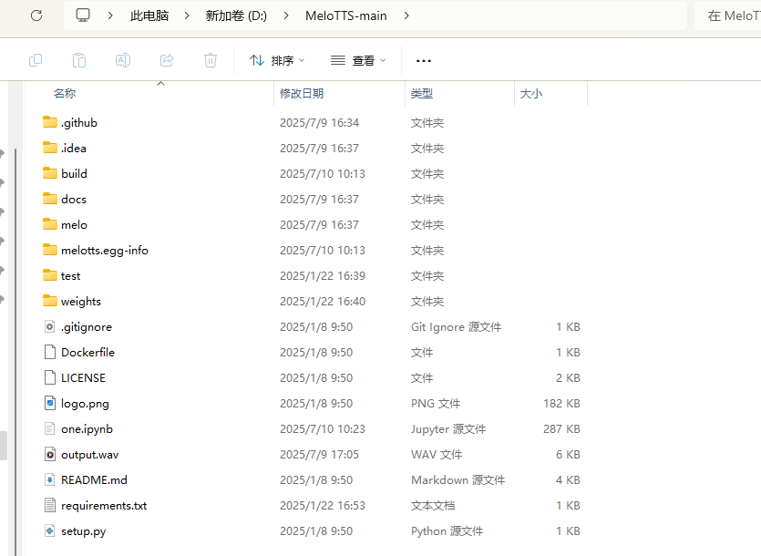


安装依赖：先按照官方安装

可能出现的问题（这是anaconda的问题）
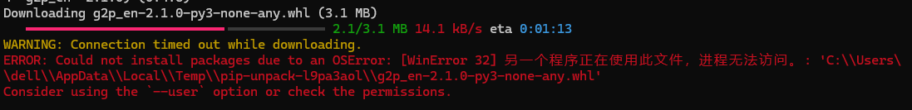
解决：
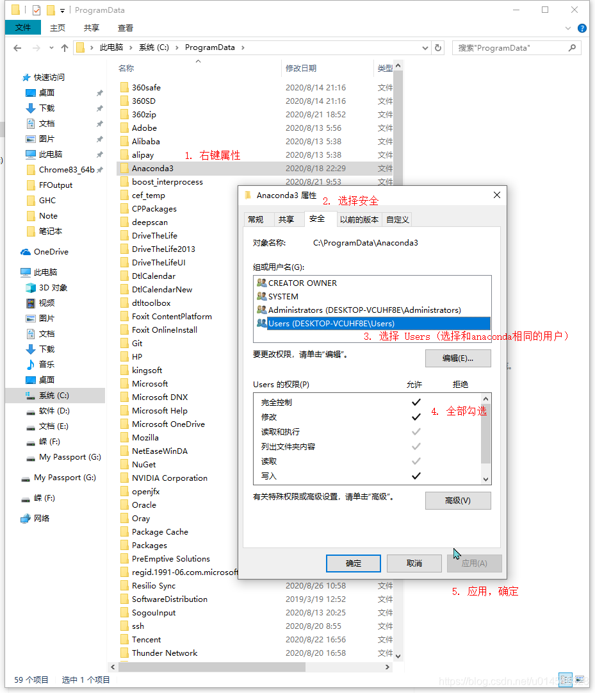

如果遇到unidic的问题:
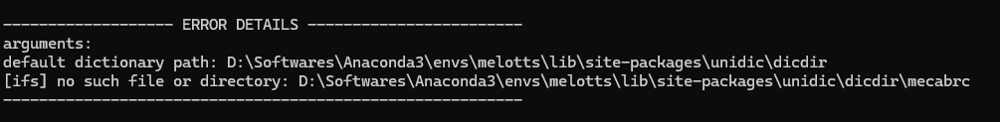

解决：
通过网盘分享的文件：unidic
链接: https://pan.baidu.com/s/1uNVHrMFaq-1e9GHMXUTowg?pwd=abma 提取码: abma
把dicdir文件夹copy过去

下载停用词资源

```bash
conda activate melotts
python
import nltk
nltk.download('stopwords')
```

启动后端：
在MeloTTS-Main的工程目录下，运行：
`uvicorn melo.fastapi_server:app --host 0.0.0.0 --port 8003 --reload`

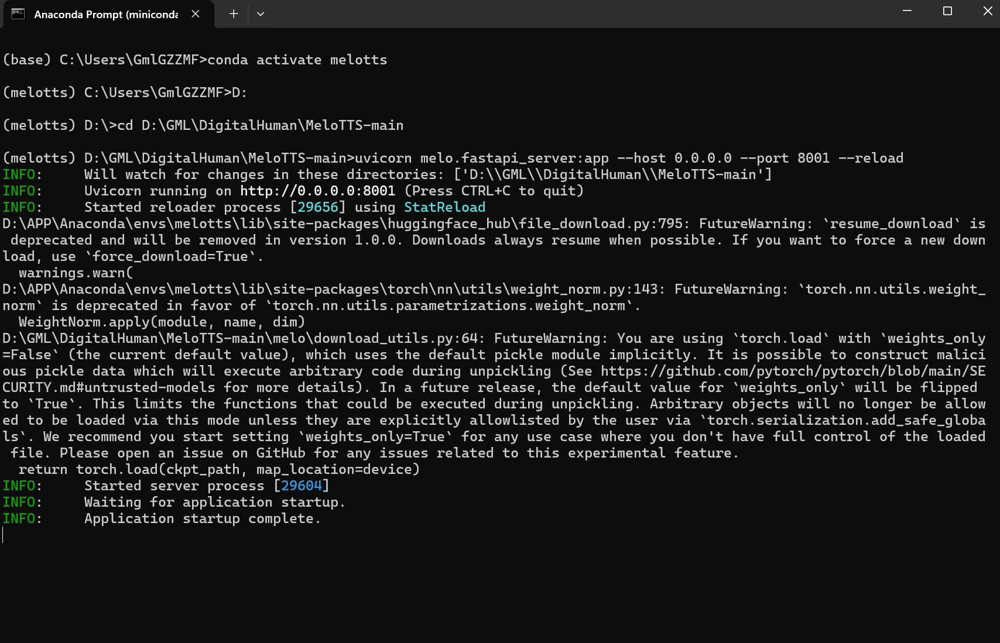

没报错的话说明成功了，

使用postman测试是否可以正常生成语音

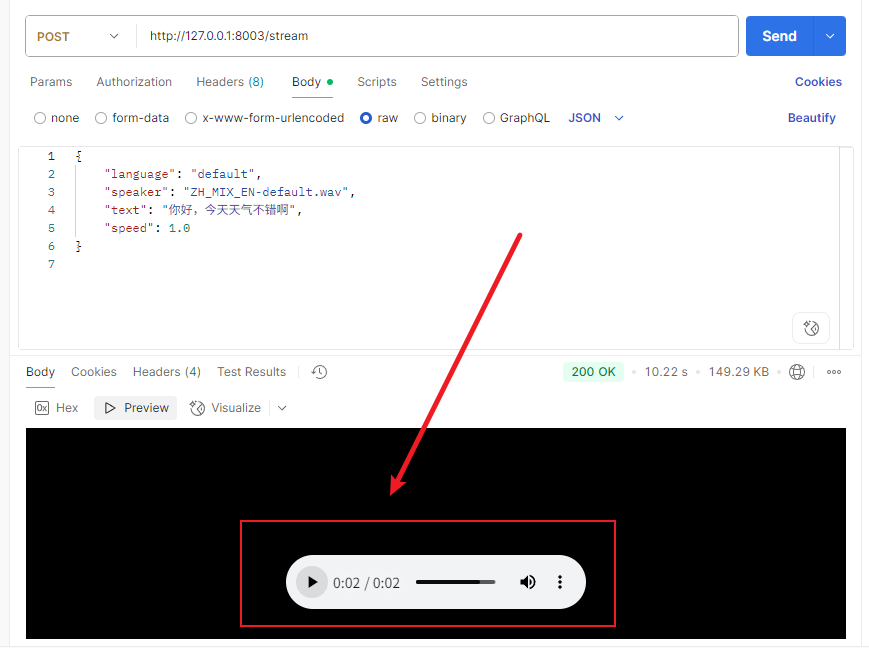


</details> 

---
