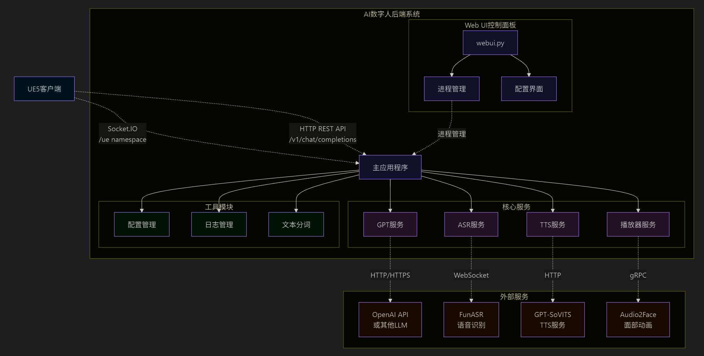

# GMTalker
<p align="center">
  
</p>

<p align="center">
  <a >English</a> | <a href="README_CN.md">中文</a>
</p>

<p align="center">
  <a href="#news">
    
  </a>
  <a href="#features">
    
  </a>
  <a href="#install">
    
  </a>
  <a href="https://drive.google.com/file/d/1756SexJhQDK3Og569RSwkgWDONhj7Zew/view?usp=sharing" target="_blank">
    
  </a>
</p>

---
**GMTalker** is a highly immersive intelligent digital human system designed specifically for Unreal Engine 5.3 by the Media Intelligence Team of Light Intelligence Lab. The system integrates speech recognition, speech synthesis, natural language understanding, lip-sync animation driving, and 3D rendering capabilities. It provides full support for local deployment and is suitable for scientific research, education, and virtual human application development. With a well-designed backend, frontend, and algorithm architecture, GMTalker establishes a complete commercial digital human pipeline.

---
This project demonstrates **two professionally customized 3D cartoon digital human models with real-world implementation effects**. These models feature full skeletal rigging and emotional animation support, making them ideal for presentations, extensions, and commercial integration.


<table>
  <tr>
    <td></td>
    <td></td>
  </tr>
</table>


<table>
  <tr>
    <th align="center">Feature Introduction</th>
    <th align="center">Demonstration Video</th>
  </tr>
  <tr>
    <td><strong>LLM+RAG</strong><br>A Q&A system based on a local knowledge base, enabling personalized information retrieval and response</td>
    <td>
      <video src="https://private-user-images.githubusercontent.com/63825035/477330477-2d05bc36-aa9a-42f4-9cd9-ef51dbdfea44.mp4?jwt=eyJ0eXAiOiJKV1QiLCJhbGciOiJIUzI1NiJ9.eyJpc3MiOiJnaXRodWIuY29tIiwiYXVkIjoicmF3LmdpdGh1YnVzZXJjb250ZW50LmNvbSIsImtleSI6ImtleTUiLCJleHAiOjE3NTUwNDk4NTMsIm5iZiI6MTc1NTA0OTU1MywicGF0aCI6Ii82MzgyNTAzNS80NzczMzA0NzctMmQwNWJjMzYtYWE5YS00MmY0LTljZDktZWY1MWRiZGZlYTQ0Lm1wND9YLUFtei1BbGdvcml0aG09QVdTNC1ITUFDLVNIQTI1NiZYLUFtei1DcmVkZW50aWFsPUFLSUFWQ09EWUxTQTUzUFFLNFpBJTJGMjAyNTA4MTMlMkZ1cy1lYXN0LTElMkZzMyUyRmF3czRfcmVxdWVzdCZYLUFtei1EYXRlPTIwMjUwODEzVDAxNDU1M1omWC1BbXotRXhwaXJlcz0zMDAmWC1BbXotU2lnbmF0dXJlPTM4N2Y4ODA5MDZmYzBmNjUxNmEwZjc3YmI0N2E3N2Y0MGNmZmVjOTVjNjMxM2MxMDVhMjYwMGFmZWFmYjM2MDUmWC1BbXotU2lnbmVkSGVhZGVycz1ob3N0In0.LOFzKacINIn6cz1QtSqPmRyWMCQkcUjxJjm628VB_I4" controls width="80%"></video>
    </td>
  </tr>
  <tr>
    <td><strong>Interrupt</strong><br>Allows users to interrupt conversations in real time via voice, enhancing interaction flexibility</td>
    <td>
      <video src="https://private-user-images.githubusercontent.com/63825035/477330917-45670b4b-a2ee-4345-8365-2a43233e2c8b.mp4?jwt=eyJ0eXAiOiJKV1QiLCJhbGciOiJIUzI1NiJ9.eyJpc3MiOiJnaXRodWIuY29tIiwiYXVkIjoicmF3LmdpdGh1YnVzZXJjb250ZW50LmNvbSIsImtleSI6ImtleTUiLCJleHAiOjE3NTUwNTAwMzAsIm5iZiI6MTc1NTA0OTczMCwicGF0aCI6Ii82MzgyNTAzNS80NzczMzA5MTctNDU2NzBiNGItYTJlZS00MzQ1LTgzNjUtMmE0MzIzM2UyYzhiLm1wND9YLUFtei1BbGdvcml0aG09QVdTNC1ITUFDLVNIQTI1NiZYLUFtei1DcmVkZW50aWFsPUFLSUFWQ09EWUxTQTUzUFFLNFpBJTJGMjAyNTA4MTMlMkZ1cy1lYXN0LTElMkZzMyUyRmF3czRfcmVxdWVzdCZYLUFtei1EYXRlPTIwMjUwODEzVDAxNDg1MFomWC1BbXotRXhwaXJlcz0zMDAmWC1BbXotU2lnbmF0dXJlPWFhMGZlYWEyOWUyM2RhNDY3YzA1ZjFkZDNlYTNhNTM0NzJiMTMxMWE4NTY5MWRjYmNiZTI1NzlhNGEyMzE1ZGYmWC1BbXotU2lnbmVkSGVhZGVycz1ob3N0In0.U0ugXLKWtNxhBhBOKYxHMdLD0crRIDZEgz1O9uEsCUM" controls width="80%"></video>
    </td>
  </tr>
</table>

<a name="news"></a>
## 🔥 NEWS
- 🗓️ **2025.9.1**: Upgrading the DunDun model with a lightweight viseme drive and packaging the full UE project into an executable (exe), aiming to reduce client-side VRAM usage to under 6GB.
- 🗓️ **2025.8.25**: Updated **UE Import Tutorial**, **Character Overview** and **Animation Overview** documents: [import_tutorial.md](./docs/ue/import_tutorial.md) | [character_overview.md](./docs/ue/character_overview.md) | [animation_overview.md](./docs/ue/animation_overview.md)  
- 🗓️ **2025.8.19**: Released UE5 project files, including the **GuangDUNDUN** character
  (jointly developed by Guangming Lab and the Shenzhen Guangming District Government).  
- 🗓️ **2025.8.12**: Added WebUI usage guide for quick project deployment.  
- 🗓️ **2025.8.11**: Added a detailed deployment guide covering C++ environment, CUDA installation, Unreal Engine installation, and Audio2Face setup.  
- 🗓️ **2025.8.5**: Released the backend system of the digital human, supporting both command-line and WebUI startup.  
- 🗓️ **2025.7.22**: Added the configuration process for ASR and TTS.  
- 🗓️ **2025.7.15**: Announced the open-source release of the 3D interactive emotional digital human, supporting local deployment and UE5 rendering.

## 📋 TODO List

- [ ] Customized appearance pipeline (covering appearance design, skeleton binding, animation production, and other complete processes)
- [x] Open-source digital human backend system with streaming transmission and support for conversation interruption
- [x] Open-source digital human engineering deployment tutorial

## 💬 Join Our Community

<p align="center">
  
  <br/>
  <strong>Scan QR code to join GMTalker technical exchange group</strong>
</p>

## 🔁 System Module Interaction Diagram

- Frontend Presentation (UE5 Client)  
- Backend Services (AI Digital Human Backend System)  
- AI Core Service Capabilities (Models + APIs)  
- Environment Management and Deployment Layer (Conda + Local Execution)  

<!-- <p align="center">
  
</p> -->


<a name="features"></a>
## 🧱 Features

- Supports voice input, understands what you say, and quickly converts it into text.  
- Allows interruption if you say something wrong, making conversations feel more natural, like chatting with a real person.  
- Converts text into natural speech with realistic tones and intonations.  
- Answers various questions using AI and remembers the context for ongoing conversations.  
- Connects to local knowledge bases, enabling answers to professional or domain-specific questions.  
- Synchronizes lip movements with speech, driven by voice input.  
- Generates facial expressions to match emotions, making interactions less rigid.  
- Supports UE5 rendering, delivering ultra-realistic visuals, like watching an animated film.


## 📊 Comparison with Other Open-Source Solutions

| Project Name     | 3D Avatar | UE5 Rendering | Voice Input | Voice Interruption | Lip Sync | Body Movements | Local Deployment (Win) | Star ⭐ |
|------------------|:---------:|:-------------:|:-----------:|:-------------------:|:--------:|:--------------:|:-----------------------:|:-------:|
| LiveTalking      | ❌        | ❌            | ❌          | ❌                  | ✅       | ❌             | ❌                      | 6.1k    |
| OpenAvatarChat   | ✅        | ❌            | ✅          | ❌                  | ✅       | ❌             | ❌                      | 1.6k    |
| MNN              | ✅        | ❌            | ✅          | ❌                  | ✅       | ✅             | ❌                      | 12.6k   |
| Fay              | ❌        | ✅            | ✅          | ✅                  | ✅       | ✅             | ✅                      | 11.6k   |
| **GMTalker**     | ✅        | ✅            | ✅          | ✅                  | ✅       | ✅             | ✅                      | 🚀      |

> ✅ indicates full support for the feature, while ❌ indicates it is missing or unsupported.

**GMTalker** is a highly immersive 3D digital human system specifically designed for B2B scenarios. It uses Unreal Engine (UE5) to render cartoon-style characters and fully supports advanced features such as voice interaction, voice interruption, and local knowledge-based Q&A. With easy deployment, it is ideal for:  
> 🎯 Offline Exhibitions · Holographic Projections · Corporate Receptions · Trade Show Interactions · Education & Training · Metaverse Customer Service, and other high-interaction scenarios.

<a name="install"></a>  
## 📦 Quick Start  

### System Requirements  

- **Python**: 3.11+  
- **Operating System**: Windows 10/11 (recommended)  
- **Memory**: 16GB+ RAM  
- **Unreal Engine**: 5.3.2  
- **Conda (Recommended)**: Anaconda or Miniconda  
- **GPU Support**: Minimum 6GB VRAM (NVIDIA GPU with CUDA support recommended)

👉 [Click here for the full installation guide install.md](docs/install.md)

### Quick Start
1. **Cloning project**
```bash
git clone  https://github.com/feima09/GMTalker.git
```
2. **One click start**
```bash
#Start using batch file (recommended)
webui.bat
   
#Or use PowerShell scripts
./webui.ps1
```
3. **Accessing Services**
- Main service:` http://127.0.0.1:5002 `
- Web configuration interface:` http://127.0.0.1:7860 `

👉 [Click here to view the WebUI User Guide webui.md](docs/webui.md)

## Configuration Description

### Main Configuration Files

- `configs/config.yaml` - Main configuration file  
- `configs/gpt/` - GPT model configuration presets  
- `configs/tts/` - TTS service configuration presets  
- `configs/hotword.txt` - Hotword configuration for wake-up  
- `configs/prompt.txt` - System prompt configuration  

## API Documentation

### REST API

#### POST `/v1/chat/completions`  
Create a new chat session, get AI responses, and play the generated speech.  

**Request Body**:  
```json
{
  "messages": [
    {
      "content": "User input text"
    }
  ],
  "stream": true
}
```

**Response**: 
- Format: `text/event-stream`
- Content: AI reply streaming text

**Response**: 
- Format: `text/event-stream`
- Content: AI's streaming text reply

#### GET `/v1/chat/new`
Create a new chat session.

### SocketIO API

#### Connection Address
```
ws://127.0.0.1:5002/socket.io
```
namespace: `/ue`

#### Event Types

- `question` - Send user question
- `aniplay` - Animation playback control
- `connect/disconnect` - Connection status

## Service Components

### GPT Service (`services/gpt/`)
- **OpenAI Compatible**: Supports OpenAI API format
- **Multi-Model**: Supports OpenAI, Qwen, etc.
- **Streaming Response**: Real-time text stream generation
- **RAG Support**: Configurable Retrieval-Augmented Generation

### TTS Service (`services/tts/`)
- **MeloTTS**: High-quality Chinese speech synthesis
- **Asynchronous Processing**: Handle multiple TTS requests in parallel
- **Fine-tuning & Inference**: Detailed fine-tuning + inference available at [MeloTTS](https://github.com/myshell-ai/MeloTTS) 
- **Weight**: For project-specific voice weights, contact [Contributor](https://github.com/Calylyli)

### ASR Service (`services/asr/`)
- **FunASR Integration**: Speech recognition based on Alibaba's FunASR
- **Wake Word Detection**: Supports custom wake words
- **Real-time Recognition**: Continuous speech recognition mode

### Player Service (`services/player/`)
- **Local Playback**: Local audio playback based on pygame
- **Lip Sync**: Synchronizes speech with facial animation
- **Audio2Face**: [Audio2Face](https://developer.nvidia.cn/omniverse?sortBy=developer_learning_library%2Fsort%2Ffeatured_in.omniverse%3Adesc%2Ctitle%3Aasc&hitsPerPage=6#section-%E5%BC%80%E5%A7%8B%E4%BD%BF%E7%94%A8) requires downloading character models via VPN and has slow initial loading; version 2023.1.1 is recommended.
- **ovrlipsync**: [ovrlipsync](https://developers.meta.com/horizon/documentation/unreal/audio-ovrlipsync-unreal) lightweight lip-sync algorithm with low latency but slightly less effective results.


### 🖼️ User Interaction Flowchart

<!-- <p align="center">
  
</p> -->


## 📚 About Guangming Laboratory

The Guangdong Provincial Laboratory of Artificial Intelligence and Digital Economy (Shenzhen) (hereinafter referred to as Guangming Laboratory) is one of the third batch of Guangdong Provincial Laboratories approved for construction by the Guangdong Provincial Government. The laboratory focuses on cutting-edge theories and future technological trends in global artificial intelligence and the digital economy, dedicated to serving major national development strategies and significant needs.

Relying on Shenzhen's industrial, geographical, and policy advantages, Guangming Laboratory brings together global scientific research forces and fully unleashes the agglomeration effect of scientific and technological innovation resources. Centered around the core task of building a domestic AI computing power ecosystem, and driven by the development of multimodal AI technology and its application ecosystem, the laboratory strives to break through key technologies, produce original achievements, and continuously advance technological innovation and industrial empowerment.

The laboratory's goal is to accelerate the supply of diversified applications and full-scenario penetration of artificial intelligence technology, achieving mutual reinforcement of technological innovation and industrial driving forces, and continuously promoting the generation of new quality productivity powered by AI.

---

### 🌐 Contact Us (Project Collaboration)

- Website: [Guangming Laboratory Official Site](https://www.gml.ac.cn/)  
- Email: [mafei@gml.ac.cn](mafei@gml.ac.cn)/[xuhongbo@gml.ac.cn](xuhongbo@gml.ac.cn)     

> **Acknowledgements**  
> Thanks to all team members and partners who participated in the development and support of the GMTalker project. (Fei Ma, Hongbo Xu, Yiming Luo, Minghui Li, Haijun Zhu, Chao Song, Yiyao Zhuo)

## License

This project is licensed under the **Creative Commons Attribution-NonCommercial 4.0 International License (CC BY-NC 4.0)**.

You are free to use, modify, and share the code and assets for **non-commercial purposes**, provided that you **give appropriate credit**.

🔗 [Full License Text](https://creativecommons.org/licenses/by-nc/4.0/legalcode)  
🔍 [Human-readable Summary](https://creativecommons.org/licenses/by-nc/4.0/)
