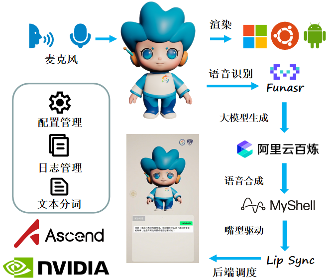

# GMTalker
<!-- <p align="center">
  
</p> -->

<p align="center">
  <a >中文</a> | <a href="README_EN.md">English</a>
</p>

<p align="center">
  <a href="#news">
    
  </a>
  <a href="#features">
    
  </a>
  <a href="#install">
    
  </a>
  <a href="https://huggingface.co/calyi/GMTalker" target="_blank">
    
  </a>
  <a href="https://drive.google.com/file/d/1prydilmo-ftSUjC4L10qylfhr_eYpKYS/view?usp=sharinghttps://drive.google.com/file/d/1prydilmo-ftSUjC4L10qylfhr_eYpKYS/view?usp=sharinghttps://drive.google.com/file/d/1prydilmo-ftSUjC4L10qylfhr_eYpKYS/view?usp=sharing" target="_blank">
    
  </a>
</p>

---

**GMTalker** 由光明实验室媒体智能团队打造的交互数字人。系统集成了语音识别、语音合成、自然语言理解、嘴型动画驱动。后端仅需2G显存即可在windows、Linux快速部署。前端可一键渲染在Windows、Linux、android，本项目展示了 **3D 卡通数字人形象的演示效果**，适用于演示、拓展和商业集成。

<!-- 系统架构图 -->
<p align="center">
  
  <br/>
  <em>系统整体架构图</em>
</p>


<a name="features"></a>
## 🧱 功能特点 / Features
- 全平台部署: 支持Windows、Linux、安卓全终端源码部署
- 离线实时: 全离线、全流式实时对话服务，毫秒级响应
- 智能交互: 支持唤醒与打断对话，各式音色训练克隆
- 模型兼容: 支持接入百炼大模型、自定义Agent、连接本地知识库
- 形象定制: 支持自定义人物及嘴型驱动与眨眼等面部微表情定义
- 高效部署: 提供高效的后端配置，无需下载任何其他依赖即可启动
- 硬件适配: 支持华为昇腾NPU部署，联网状态下纯CPU部署


<table align="center">
  <tr>
    <td style="text-align:center">
      
    </td>
    <td style="text-align:center">
      
    </td>
  </tr>
</table>

<!-- <table>
  <tr>
    <th align="center">功能介绍</th>
    <th align="center">落地应用演示视频</th>
  </tr>
  <tr>
    <td><strong>Interrupt</strong><br>支持用户通过语音实时打断对话，提升交互灵活性</td>
    <td>
      <video src="https://private-user-images.githubusercontent.com/63825035/477330917-45670b4b-a2ee-4345-8365-2a43233e2c8b.mp4?jwt=eyJ0eXAiOiJKV1QiLCJhbGciOiJIUzI1NiJ9.eyJpc3MiOiJnaXRodWIuY29tIiwiYXVkIjoicmF3LmdpdGh1YnVzZXJjb250ZW50LmNvbSIsImtleSI6ImtleTUiLCJleHAiOjE3NTUwNTAwMzAsIm5iZiI6MTc1NTA0OTczMCwicGF0aCI6Ii82MzgyNTAzNS80NzczMzA5MTctNDU2NzBiNGItYTJlZS00MzQ1LTgzNjUtMmE0MzIzM2UyYzhiLm1wND9YLUFtei1BbGdvcml0aG09QVdTNC1ITUFDLVNIQTI1NiZYLUFtei1DcmVkZW50aWFsPUFLSUFWQ09EWUxTQTUzUFFLNFpBJTJGMjAyNTA4MTMlMkZ1cy1lYXN0LTElMkZzMyUyRmF3czRfcmVxdWVzdCZYLUFtei1EYXRlPTIwMjUwODEzVDAxNDg1MFomWC1BbXotRXhwaXJlcz0zMDAmWC1BbXotU2lnbmF0dXJlPWFhMGZlYWEyOWUyM2RhNDY3YzA1ZjFkZDNlYTNhNTM0NzJiMTMxMWE4NTY5MWRjYmNiZTI1NzlhNGEyMzE1ZGYmWC1BbXotU2lnbmVkSGVhZGVycz1ob3N0In0.U0ugXLKWtNxhBhBOKYxHMdLD0crRIDZEgz1O9uEsCUM" controls width="70%"></video>
    </td>
  </tr>
</table> -->


<a name="news"></a>
## 🔥 更新日志 / NEWS

- 🗓️ **2025.10.15**: 后端支持Docker部署，详细转到[Docker文档](./docs/docker.md)
- 🗓️ **2025.10.10**: 现全面支持GPU与NPU 910B服务器，FunASR 语音识别依托 ONNX 运行时，而 TTS 语音合成则采用 torch_npu。
- 🗓️ **2025.9.12**: 项目现已完整支持 Android, Linux, Web 及 Windows 全平台，端侧无需依赖GPU。
- 🗓️ **2025.9.1**: 为模型升级轻量级嘴型驱动，并将完整UE工程打包为独立可执行文件（.exe）普通笔记本也能流畅运行。
- 🗓️ **2025.8.25**：更新了[导入UE形象](./docs/ue/import_tutorial.md) | [形象介绍](./docs/ue/character_overview.md) | [动画展示](./docs/ue/animation_overview.md)文档.
- 🗓️ **2025.8.19**：开源 UE5 工程文件，并附带 **光墩墩** 形象  （光明实验室与深圳市光明区政府联合研发）。
- 🗓️ **2025.8.12**：新增了WebUI使用指南，快速实现项目启动。

## 💬 加入社群

<p align="center">
  
  <br/>
  <strong>扫码加入GMTalker技术交流群</strong>
</p>

<a name="install"></a>
## 📦 快速开始

#### 后端配置后启动，应用安装包下载，Funasr+melotts一键启动即可运行，无需准备其他环境与依赖。

### 硬件要求
- **操作系统**：Windows 10+ / Linux
- **内存**：8GB+ RAM
- **GPU支持**：需2GB以上显存（推荐支持CUDA的NVIDIA GPU）

1. **克隆项目**
   ```bash
   git clone https://github.com/feima09/GMTalker.git
   ```

2. **一键启动**
   
   **Windows 系统：**
   ```bash
   webui.bat
   ```
   
   **Linux 系统：**
   ```bash
   chmod +x webui.sh
   ./webui.sh
   ```
   
   **使用 Docker 部署（推荐）：**
   ```bash
   # 使用 docker-compose
   docker-compose up -d
   
   # 或使用 docker cli
   docker run -d \
     --name gmtalker \
     -p 5002:5002 -p 7860:7860 \
     -v $(pwd)/configs:/app/configs \
     huiji2333/gmtalker:latest
   ```

   👉 [Docker部署后端指南](docs/docker.md)

3. **访问服务**
   - 主服务：`http://127.0.0.1:5002`
   - Web配置界面：`http://127.0.0.1:7860`

👉 点击这里查看WebUI[使用指南](docs/webui.md)

4. **下载**
   - 下载并启动GLM3.exe [Windows版 Google云](https://drive.google.com/file/d/1EO_E33blpLcKop6l1Ta5-PQTCtZVYxLu/view?usp=sharing) [Windows版 百度网盘](https://pan.baidu.com/s/1WbiLS5wyGss_JvUet5mx_g?pwd=w2sb) [Linux版 Google云](https://drive.google.com/file/d/1ZpKmLAm2yiKJT_4tPzX4VGv7_RNoWNx5/view?usp=sharing) [Linux版 百度网盘](https://pan.baidu.com/s/1adBv9ZYMC5pBhPckaVHJJg?pwd=kit5)
 
5. **端侧必备部署AI服务**
   - Funasr语音识别懒人包[下载](https://github.com/1m1ng/FunASR/releases/download/Complete-Package/FunASR.7z)后，运行 `run_server_2pass.bat` 一键启动
   - Melotts语音合成懒人包[下载](https://github.com/1m1ng/MeloTTS/releases/download/Complete-Package/MeloTTS.7z)后，运行 `start.bat` 一键启动

👉 如果您需要从源码进行开发，请点击这里查看完整[安装指南](docs/install.md)，后端整体架构请[查看](docs/relate.md)

## 📊 与其他开源方案对比


| 项目名称         | 3D 精灵形象 | UE5 渲染 | 语音输入 | 语音打断 | 嘴型驱动 | 肢体动作 | 本地部署(Win) | Star ⭐ |
|------------------|:-------:|:--------:|:--------:|:--------:|:--------:|:--------:|:--------:|:-------:|
| LiveTalking      | ❌      | ❌       | ❌       | ❌       | ✅        | ❌       | ❌       | 6.1k    |
| OpenAvatarChat   | ✅| ❌     | ✅       | ❌       | ✅     | ❌       | ❌       | 1.6k    |
| MNN              | ✅      | ❌       | ✅       | ❌       | ✅              | ✅       | ❌| 12.6k   |
| Fay              | ❌      | ✅       | ✅             | ✅       | ✅       | ✅       | ✅       | 11.6k   |
| **GMTalker** | ✅| ✅       | ✅       | ✅             | ✅       | ✅       | ✅ | 🚀 |

> ✅ 表示功能完整支持，❌ 表示缺失或不支持

## 📚 关于光明实验室

人工智能与数字经济广东省实验室（深圳）（以下简称光明实验室）是广东省政府批准建设的第三批广东省实验室之一。实验室面向全球人工智能与数字经济的前沿理论和未来技术发展趋势，致力于服务国家重大发展战略和重大需求。

光明实验室依托深圳地区的产业优势、地缘优势和政策优势，聚集全球科研力量，充分激发科技创新资源的集聚效应。实验室围绕国产 AI 算力生态建设的任务核心，以多模态 AI 技术与应用生态建设为关键牵引，通过突破一批关键技术、催生一批原创成果，持续推进科技创新和产业赋能。

实验室的目标是加快人工智能技术在多元应用供给与全场景渗透，实现科技创新与产业驱动互促双强，不断促进以 AI 为引擎的新质生产力生成。

---

### 🌐 联系我们（项目合作）

- 官网：[光明实验室官网](https://www.gml.ac.cn/)  
- 邮箱：[mafei@gml.ac.cn](mafei@gml.ac.cn)/[xuhongbo@gml.ac.cn](xuhongbo@gml.ac.cn)   


> **致谢**  
> 感谢所有参与开发和支持 GMTalker 项目的团队成员与合作伙伴。(马飞, 徐洪波, 李明辉, 罗奕明, 朱海俊, 卓一瑶, 宋超)

## License

This project is licensed under the **Creative Commons Attribution-NonCommercial 4.0 International License (CC BY-NC 4.0)**.

You are free to use, modify, and share the code and assets for **non-commercial purposes**, provided that you **give appropriate credit**.

🔗 [Full License Text](https://creativecommons.org/licenses/by-nc/4.0/legalcode)  
🔍 [Human-readable Summary](https://creativecommons.org/licenses/by-nc/4.0/)