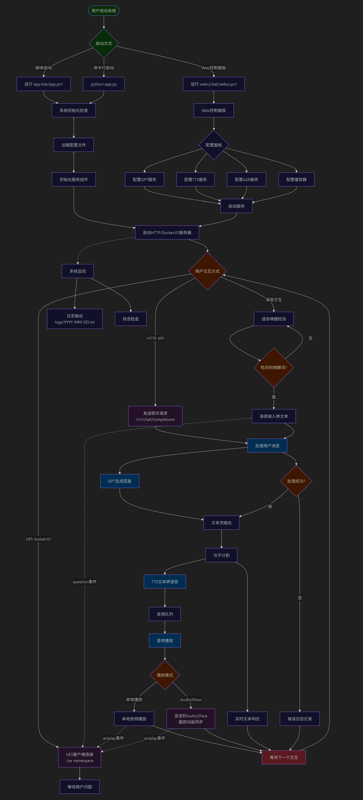

# GMTalker
<p align="center">
  
</p>


<p align="center">
  <a >中文</a> | <a href="README_EN.md">English</a>
</p>


<p align="center">
  <a href="#news">
    
  </a>
  <a href="#features">
    
  </a>
  <a href="#install">
    
  </a>
  <a href="https://drive.google.com/file/d/1756SexJhQDK3Og569RSwkgWDONhj7Zew/view?usp=sharing" target="_blank">
    
  </a>
</p>

---

**GMTalker** 是由光明实验室媒体智能团队打造的一款专为虚幻引擎 5.3 设计的高沉浸式智能数字人系统。系统集成了语音识别、语音合成、自然语言理解、嘴型动画驱动与3D渲染能力，具备完整的本地部署支持，适用于科研、教育及虚拟人应用开发场景。通过完善的后端、前端和算法设计，GMTalker 构建了一个完整的商业化数字人 Pipeline。

---

本项目展示了 **两款专业定制的 3D 卡通数字人形象的落地演示效果**，具备完整骨骼绑定与情绪动画支持，适用于演示、拓展和商业集成。

<table>
  <tr>
    <td></td>
    <td></td>
  </tr>
</table>


<table>
  <tr>
    <th align="center">功能介绍</th>
    <th align="center">落地应用演示视频</th>
  </tr>
  <tr>
    <td><strong>LLM+RAG</strong><br>基于本地知识库的问答系统，实现个性化信息检索与回复</td>
    <td>
      <video src="https://private-user-images.githubusercontent.com/63825035/477330477-2d05bc36-aa9a-42f4-9cd9-ef51dbdfea44.mp4?jwt=eyJ0eXAiOiJKV1QiLCJhbGciOiJIUzI1NiJ9.eyJpc3MiOiJnaXRodWIuY29tIiwiYXVkIjoicmF3LmdpdGh1YnVzZXJjb250ZW50LmNvbSIsImtleSI6ImtleTUiLCJleHAiOjE3NTUwNDk4NTMsIm5iZiI6MTc1NTA0OTU1MywicGF0aCI6Ii82MzgyNTAzNS80NzczMzA0NzctMmQwNWJjMzYtYWE5YS00MmY0LTljZDktZWY1MWRiZGZlYTQ0Lm1wND9YLUFtei1BbGdvcml0aG09QVdTNC1ITUFDLVNIQTI1NiZYLUFtei1DcmVkZW50aWFsPUFLSUFWQ09EWUxTQTUzUFFLNFpBJTJGMjAyNTA4MTMlMkZ1cy1lYXN0LTElMkZzMyUyRmF3czRfcmVxdWVzdCZYLUFtei1EYXRlPTIwMjUwODEzVDAxNDU1M1omWC1BbXotRXhwaXJlcz0zMDAmWC1BbXotU2lnbmF0dXJlPTM4N2Y4ODA5MDZmYzBmNjUxNmEwZjc3YmI0N2E3N2Y0MGNmZmVjOTVjNjMxM2MxMDVhMjYwMGFmZWFmYjM2MDUmWC1BbXotU2lnbmVkSGVhZGVycz1ob3N0In0.LOFzKacINIn6cz1QtSqPmRyWMCQkcUjxJjm628VB_I4" controls width="80%"></video>
    </td>
  </tr>
  <tr>
    <td><strong>Interrupt</strong><br>支持用户通过语音实时打断对话，提升交互灵活性</td>
    <td>
      <video src="https://private-user-images.githubusercontent.com/63825035/477330917-45670b4b-a2ee-4345-8365-2a43233e2c8b.mp4?jwt=eyJ0eXAiOiJKV1QiLCJhbGciOiJIUzI1NiJ9.eyJpc3MiOiJnaXRodWIuY29tIiwiYXVkIjoicmF3LmdpdGh1YnVzZXJjb250ZW50LmNvbSIsImtleSI6ImtleTUiLCJleHAiOjE3NTUwNTAwMzAsIm5iZiI6MTc1NTA0OTczMCwicGF0aCI6Ii82MzgyNTAzNS80NzczMzA5MTctNDU2NzBiNGItYTJlZS00MzQ1LTgzNjUtMmE0MzIzM2UyYzhiLm1wND9YLUFtei1BbGdvcml0aG09QVdTNC1ITUFDLVNIQTI1NiZYLUFtei1DcmVkZW50aWFsPUFLSUFWQ09EWUxTQTUzUFFLNFpBJTJGMjAyNTA4MTMlMkZ1cy1lYXN0LTElMkZzMyUyRmF3czRfcmVxdWVzdCZYLUFtei1EYXRlPTIwMjUwODEzVDAxNDg1MFomWC1BbXotRXhwaXJlcz0zMDAmWC1BbXotU2lnbmF0dXJlPWFhMGZlYWEyOWUyM2RhNDY3YzA1ZjFkZDNlYTNhNTM0NzJiMTMxMWE4NTY5MWRjYmNiZTI1NzlhNGEyMzE1ZGYmWC1BbXotU2lnbmVkSGVhZGVycz1ob3N0In0.U0ugXLKWtNxhBhBOKYxHMdLD0crRIDZEgz1O9uEsCUM" controls width="80%"></video>
    </td>
  </tr>
</table>


<a name="news"></a>
## 🔥 更新日志 / NEWS
- 🗓️ **2025.8.25**：更新了 **UE 导入教程**, **形象整体介绍** 与 **动画介绍** 文档： [import_tutorial.md](./docs/ue/import_tutorial.md) | [character_overview.md](./docs/ue/character_overview.md) | [animation_overview.md](./docs/ue/animation_overview.md)    
- 🗓️ **2025.8.19**：开源 UE5 工程文件，并附带 **光墩墩** 形象  （光明实验室与深圳市光明区政府联合研发）
- 🗓️ **2025.8.12**：新增了WebUI使用指南，快速实现项目启动
- 🗓️ **2025.8.11**：新增详细部署指南，覆盖 C++ 环境、CUDA 安装、虚幻引擎安装、Audio2Face 安装等关键步骤
- 🗓️ **2025.8.5**：开源数字人后端系统，支持命令行启动以及WebUI启动  
- 🗓️ **2025.7.22**：加入 ASR、TTS 的配置过程
- 🗓️ **2025.7.15**：3D 交互式情感数字人正式宣布开源，支持本地部署与 UE5 渲染

## 📋 TODO List

- [ ] 形象定制 Pipeline（涉及形象设计、骨骼绑定、动画制作等完整流程）
- [x] 开源数字人后端系统，流式传输，支持对话打断
- [x] 开源数字人工程部署教程

## 💬 加入社群

<p align="center">
  
  <br/>
  <strong>扫码加入GMTalker技术交流群</strong>
</p>

## 🔁 系统模块交互架构图

- 前端呈现（UE5 客户端）
- 后端服务（AI 数字人后端系统）
- AI 核心服务能力（模型 + API）
- 环境管理与部署层（Conda + 本地运行）

<p align="center">
  
</p>


<a name="features"></a>
## 🧱 功能特点 / Features

- 支持语音输入，能听懂你说的话，并快速转成文字  
- 支持说错可以打断，让对话更像和真人聊天一样  
- 支持把文字变成自然的语音，语气真实、语调自然  
- 支持用 AI 回答各种问题，还能记住上下文接着聊  
- 支持连接本地知识库，问它专业问题也能答上来  
- 支持根据语音驱动嘴型，和说话内容同步张嘴  
- 支持配合情绪做表情动作，不再死板  
- 支持 UE5 渲染，画面超真实，像在看一场动画片


## 📊 与其他开源方案对比


| 项目名称         | 3D 精灵形象 | UE5 渲染 | 语音输入 | 语音打断 | 嘴型驱动 | 肢体动作 | 本地部署(Win) | Star ⭐ |
|------------------|:-------:|:--------:|:--------:|:--------:|:--------:|:--------:|:--------:|:-------:|
| LiveTalking      | ❌      | ❌       | ❌       | ❌       | ✅        | ❌       | ❌       | 6.1k    |
| OpenAvatarChat   | ✅| ❌     | ✅       | ❌       | ✅     | ❌       | ❌       | 1.6k    |
| MNN              | ✅      | ❌       | ✅       | ❌       | ✅              | ✅       | ❌| 12.6k   |
| Fay              | ❌      | ✅       | ✅             | ✅       | ✅       | ✅       | ✅       | 11.6k   |
| **GMTalker** | ✅| ✅       | ✅       | ✅             | ✅       | ✅       | ✅ | 🚀 |

> ✅ 表示功能完整支持，❌ 表示缺失或不支持

**GMTalker** 是专为 B 端场景打造的高沉浸式 3D 数字人系统，采用虚幻引擎（UE5）渲染卡通风格角色，全面支持语音交互、语音打断、本地知识问答等高级功能，部署便捷，适用于：
> 🎯 线下展厅 · 全息投影 · 企业前台 · 商展互动 · 教育培训 · 元宇宙客服等高互动场景


<a name="install"></a>
## 📦 快速开始

### 环境要求

- **Python**：3.11+
- **操作系统**：Windows 10/11 (推荐)
- **内存**：8GB+ RAM
- **Unreal Engine**：5.3.2
- **Conda（推荐）**：Anaconda 或 Miniconda
- **GPU支持**：建议使用带有CUDA支持的NVIDIA显卡(单卡3090 及以上)

👉 [点击这里查看完整安装指南 install.md](docs/install.md)

### 快速启动

1. **克隆项目**
   ```bash
   git clone https://github.com/feima09/GMTalker.git
   ```

2. **一键启动**
   ```bash
   # 使用批处理文件启动（推荐）
   webui.bat
   
   # 或使用PowerShell脚本
   ./webui.ps1
   ```

3. **访问服务**
   - 主服务：`http://127.0.0.1:5002`
   - Web配置界面：`http://127.0.0.1:7860`

👉 [点击这里查看WebUI使用指南 webui.md](docs/webui.md)

## 配置说明

### 主要配置文件

- `configs/config.yaml` - 主配置文件
- `configs/gpt/` - GPT模型配置预设
- `configs/tts/` - TTS服务配置预设
- `configs/hotword.txt` - 语音唤醒词配置
- `configs/prompt.txt` - 系统提示词

## API文档

### REST API

#### POST `/v1/chat/completions`
创建新的聊天对话，获取AI回复并播放语音。

**请求体**:
```json
{
  "messages": [
    {
      "content": "用户输入文本"
    }
  ]
}
```

**响应**: 
- 格式: `text/event-stream`
- 内容: AI回复的流式文本

#### GET `/v1/chat/new`
创建新的聊天会话。

### SocketIO API

#### 连接地址
```
ws://127.0.0.1:5002/socket.io
```
namespace: `/ue`

#### 事件类型

- `question` - 发送用户问题
- `aniplay` - 动画播放控制
- `connect/disconnect` - 连接状态

## 服务组件

### GPT服务 (`services/gpt/`)
- **OpenAI兼容**: 支持OpenAI API格式
- **多模型**: 支持OpenAI、通义千问等
- **流式响应**: 实时生成文本流
- **RAG支持**: 可配置检索增强生成

### TTS服务 (`services/tts/`)
- **MeloTTS**: 高质量中文语音合成
- **异步处理**: 并行处理多个TTS请求
- **微调推理**:详细微调+推理可以访问[MeloTTS](https://github.com/myshell-ai/MeloTTS) 
- **Weight**：如需本项目音色权重可以联系[贡献者](https://github.com/Calylyli)

### ASR服务 (`services/asr/`)
- **FunASR集成**: 基于阿里FunASR的语音识别
- **唤醒词检测**: 支持自定义唤醒词
- **实时识别**: 连续语音识别模式

### 播放器服务 (`services/player/`)
- **本地播放**: 基于pygame的本地音频播放
- **唇形同步**: 实现语音与面部动画同步
- **Audio2Face**: [Audio2Face](https://developer.nvidia.cn/omniverse?sortBy=developer_learning_library%2Fsort%2Ffeatured_in.omniverse%3Adesc%2Ctitle%3Aasc&hitsPerPage=6#section-%E5%BC%80%E5%A7%8B%E4%BD%BF%E7%94%A8)由于需要通过VPN下载人物模型并且项目首次加载缓慢，版本选择2023.1.1。
- **ovrlipsync**: [ovrlipsync](https://developers.meta.com/horizon/documentation/unreal/audio-ovrlipsync-unreal)轻量型嘴型驱动算法时延低但效果稍逊。


### 🖼️ 用户交互流程图

<p align="center">
  
</p>

## 📚 关于光明实验室

人工智能与数字经济广东省实验室（深圳）（以下简称光明实验室）是广东省政府批准建设的第三批广东省实验室之一。实验室面向全球人工智能与数字经济的前沿理论和未来技术发展趋势，致力于服务国家重大发展战略和重大需求。

光明实验室依托深圳地区的产业优势、地缘优势和政策优势，聚集全球科研力量，充分激发科技创新资源的集聚效应。实验室围绕国产 AI 算力生态建设的任务核心，以多模态 AI 技术与应用生态建设为关键牵引，通过突破一批关键技术、催生一批原创成果，持续推进科技创新和产业赋能。

实验室的目标是加快人工智能技术在多元应用供给与全场景渗透，实现科技创新与产业驱动互促双强，不断促进以 AI 为引擎的新质生产力生成。

---

### 🌐 联系我们（项目合作）

- 官网：[光明实验室官网](https://www.gml.ac.cn/)  
- 邮箱：[mafei@gml.ac.cn](mafei@gml.ac.cn)/[xuhongbo@gml.ac.cn](xuhongbo@gml.ac.cn)   


> **致谢**  
> 感谢所有参与开发和支持 GMTalker 项目的团队成员与合作伙伴。(马飞, 徐洪波, 罗奕明, 李明辉, 朱海俊, 宋超, 卓一瑶)

## License

This project is licensed under the **Creative Commons Attribution-NonCommercial 4.0 International License (CC BY-NC 4.0)**.

You are free to use, modify, and share the code and assets for **non-commercial purposes**, provided that you **give appropriate credit**.

🔗 [Full License Text](https://creativecommons.org/licenses/by-nc/4.0/legalcode)  
🔍 [Human-readable Summary](https://creativecommons.org/licenses/by-nc/4.0/)
