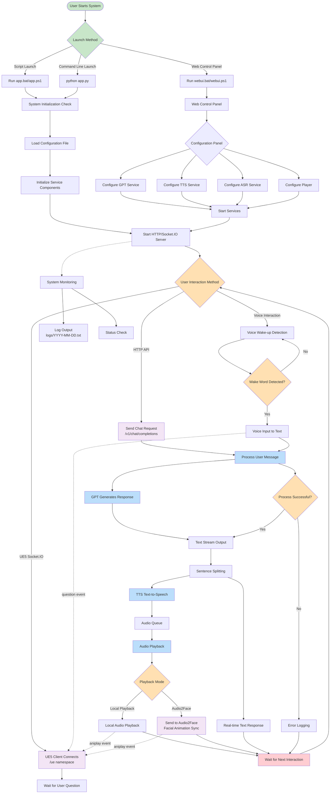
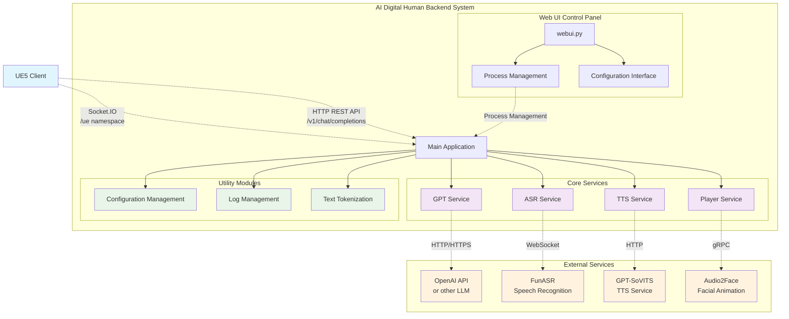

### Main Configuration Files

- `configs/config.yaml` - Main configuration file  
- `configs/gpt/` - GPT model configuration presets  
- `configs/tts/` - TTS service configuration presets  
- `configs/hotword.txt` - Hotword configuration for wake-up  
- `configs/prompt.txt` - System prompt configuration  

## API Documentation

### REST API

#### POST `/v1/chat/completions`  
Create a new chat session, get AI responses, and play the generated speech.  

**Request Body**:  
```json
{
  "messages": [
    {
      "content": "User input text"
    }
  ],
  "stream": true
}
```

**Response**: 
- Format: `text/event-stream`
- Content: AI reply streaming text

**Response**: 
- Format: `text/event-stream`
- Content: AI's streaming text reply

#### GET `/v1/chat/new`
Create a new chat session.

### SocketIO API

#### Connection Address
```
ws://127.0.0.1:5002/socket.io
```
namespace: `/ue`

#### Event Types

- `question` - Send user question
- `aniplay` - Animation playback control
- `connect/disconnect` - Connection status

## Service Components

### GPT Service (`services/gpt/`)
- **OpenAI Compatible**: Supports OpenAI API format
- **Multi-Model**: Supports OpenAI, Qwen, etc.
- **Streaming Response**: Real-time text stream generation
- **RAG Support**: Configurable Retrieval-Augmented Generation

### TTS Service (`services/tts/`)
- **MeloTTS**: High-quality Chinese speech synthesis
- **Asynchronous Processing**: Handle multiple TTS requests in parallel
- **Fine-tuning & Inference**: Detailed fine-tuning + inference available at [MeloTTS](https://github.com/myshell-ai/MeloTTS) 
- **Weight**: For project-specific voice weights, contact [Contributor](https://github.com/Calylyli)

### ASR Service (`services/asr/`)
- **FunASR Integration**: Speech recognition based on Alibaba's FunASR
- **Wake Word Detection**: Supports custom wake words
- **Real-time Recognition**: Continuous speech recognition mode

### Player Service (`services/player/`)
- **Local Playback**: Local audio playback based on pygame
- **Lip Sync**: Synchronizes speech with facial animation
- **Audio2Face**: [Audio2Face](https://developer.nvidia.cn/omniverse?sortBy=developer_learning_library%2Fsort%2Ffeatured_in.omniverse%3Adesc%2Ctitle%3Aasc&hitsPerPage=6#section-%E5%BC%80%E5%A7%8B%E4%BD%BF%E7%94%A8) requires downloading character models via VPN and has slow initial loading; version 2023.1.1 is recommended.
- **ovrlipsync**: [ovrlipsync](https://developers.meta.com/horizon/documentation/unreal/audio-ovrlipsync-unreal) lightweight lip-sync algorithm with low latency but slightly less effective results.


### 🖼️ User Interaction Flowchart

<!-- <p align="center">
  
</p> -->


## 🔁 System Module Interaction Diagram

- Frontend Presentation (UE5 Client)  
- Backend Services (AI Digital Human Backend System)  
- AI Core Service Capabilities (Models + APIs)  
- Environment Management and Deployment Layer (Conda + Local Execution)  

<!-- <p align="center">
  
</p> -->

