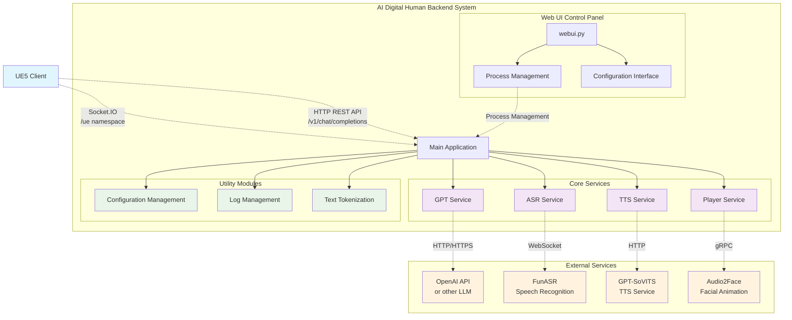

## 🔁 System Module Interaction Diagram

- Frontend Presentation (UE5 Client)  
- Backend Services (AI Digital Human Backend System)  
- AI Core Service Capabilities (Models + APIs)  
- Environment Management and Deployment Layer (Conda + Local Execution)  

<!-- <p align="center">
  
</p> -->



### 主要配置文件

- `configs/config.yaml` - 主配置文件
- `configs/gpt/` - GPT模型配置预设
- `configs/tts/` - TTS服务配置预设
- `configs/hotword.txt` - 语音唤醒词配置
- `configs/prompt.txt` - 系统提示词

## API文档

### REST API

#### POST `/v1/chat/completions`
创建新的聊天对话，获取AI回复并播放语音。

**请求体**:
```json
{
  "messages": [
    {
      "content": "用户输入文本"
    }
  ]
}
```

**响应**: 
- 格式: `text/event-stream`
- 内容: AI回复的流式文本

#### GET `/v1/chat/new`
创建新的聊天会话。

### SocketIO API

#### 连接地址
```
ws://127.0.0.1:5002/socket.io
```
namespace: `/ue`

#### 事件类型

- `question` - 发送用户问题
- `aniplay` - 动画播放控制
- `connect/disconnect` - 连接状态

## 服务组件

### GPT服务 (`services/gpt/`)
- **OpenAI兼容**: 支持OpenAI API格式
- **多模型**: 支持OpenAI、通义千问等
- **流式响应**: 实时生成文本流
- **RAG支持**: 可配置检索增强生成

### TTS服务 (`services/tts/`)
- **MeloTTS**: 高质量中文语音合成
- **异步处理**: 并行处理多个TTS请求
- **微调推理**:详细微调+推理可以访问[MeloTTS](https://github.com/myshell-ai/MeloTTS) 
- **Weight**：如需本项目音色权重可以联系[贡献者](https://github.com/Calylyli)

### ASR服务 (`services/asr/`)
- **FunASR集成**: 基于阿里FunASR的语音识别
- **唤醒词检测**: 支持自定义唤醒词
- **实时识别**: 连续语音识别模式

### 播放器服务 (`services/player/`)
- **本地播放**: 基于pygame的本地音频播放
- **唇形同步**: 实现语音与面部动画同步
- **Audio2Face（弃用）**: [Audio2Face](https://developer.nvidia.cn/omniverse?sortBy=developer_learning_library%2Fsort%2Ffeatured_in.omniverse%3Adesc%2Ctitle%3Aasc&hitsPerPage=6#section-%E5%BC%80%E5%A7%8B%E4%BD%BF%E7%94%A8)由于需要通过VPN下载人物模型并且项目首次加载缓慢，版本选择2023.1.1。
- **ovrlipsync**: [ovrlipsync](https://developers.meta.com/horizon/documentation/unreal/audio-ovrlipsync-unreal)轻量型嘴型驱动算法时延低但效果稍逊。


### 🖼️ 用户交互流程图

<p align="center">
  
</p>