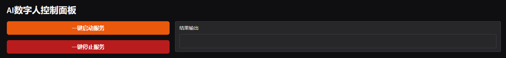
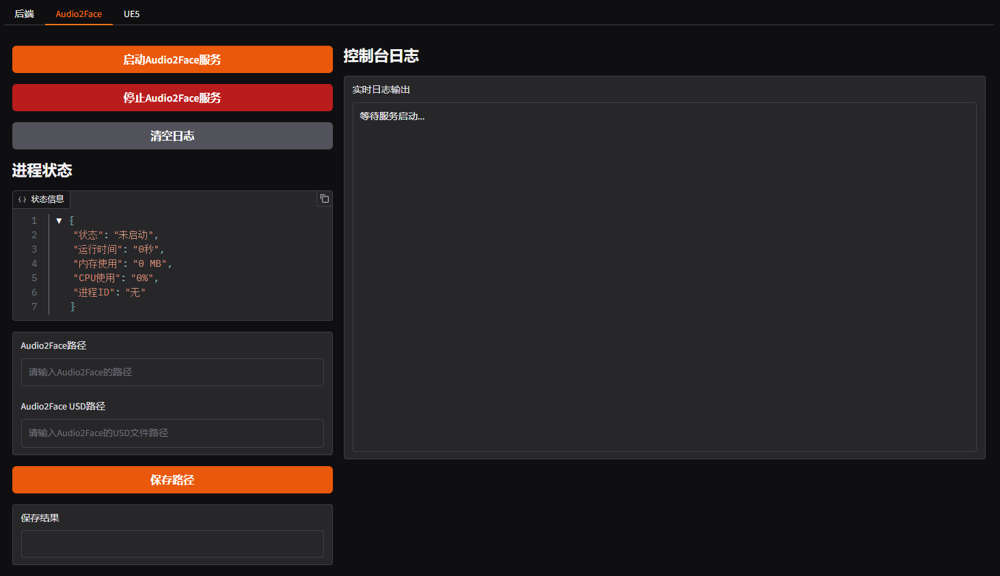
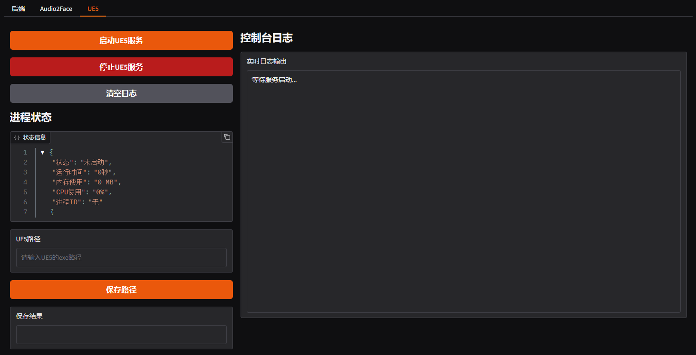
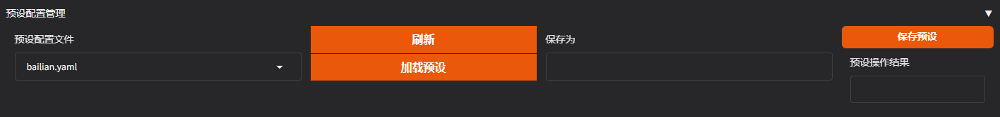
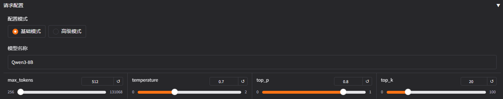
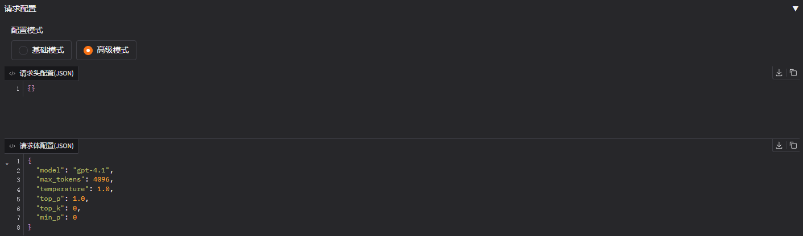
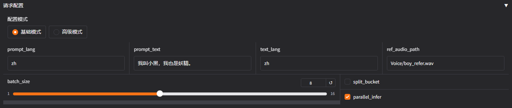

# AI数字人Webui使用教程

## 概述

AI数字人Webui是一个基于Gradio的Web控制面板，为AI数字人后端系统提供可视化的配置管理和服务监控功能。通过直观的Web界面，用户可以轻松配置各种服务参数、监控系统状态，并一键启动/停止相关服务。

## 界面介绍

### 控制面板

控制面板是系统的核心监控中心，提供以下功能：

#### 服务管理
- **一键启动服务**: 批量启动所有已配置的服务
- **一键停止服务**: 安全关闭所有运行中的服务
- **单独服务控制**: 可独立启动/停止特定服务



#### 进程监控
- **Audio2Face进程管理**
  - 需要配置Audio2Face可执行文件路径
  - 需要配置USD场景文件路径
  - 支持启动后自动加载USD配置文件



- **UE5进程管理**  
  - 需要配置UE5可执行文件路径
  - 支持启动UE5客户端应用



#### 状态监控
- 实时显示各服务运行状态
- 显示服务端口占用情况
- 提供详细的错误信息和日志

### 配置面板

配置面板用于设置系统各组件的参数，确保服务正常运行。

#### 基本配置

系统核心参数设置：

- **日志等级**: 控制系统日志输出详细程度
  - `DEBUG`: 详细调试信息
  - `INFO`: 一般信息（推荐）
  - `WARNING`: 警告信息
  - `ERROR`: 仅错误信息
- **服务器主机**: 后端服务绑定的IP地址（默认：127.0.0.1）
- **服务器端口**: 后端服务监听端口（默认：5002）

#### GPT配置

大语言模型相关配置，支持多种LLM服务提供商。

##### 预设配置管理

为了便于快速切换不同的GPT配置，系统提供预设管理功能：

- **保存预设**: 将当前GPT配置保存为命名预设
- **加载预设**: 一键加载已保存的配置预设
- **删除预设**: 移除不需要的配置预设
- **预设列表**: 显示所有可用的配置预设



##### GPT基础参数

- **GPT类型**: 选择LLM服务提供商
  - `OpenAI`: 支持OpenAI官方API及兼容接口
  - `百炼应用`: 阿里云百炼大模型应用
- **API URL**: LLM服务的API端点地址
- **API密钥**: 访问LLM服务所需的API Key

##### API测试功能

Webui内置API测试工具，帮助验证配置的正确性：
- 发送测试请求到配置的API端点
- 验证API密钥的有效性
- 检查网络连接和响应时间

##### 请求配置

系统提供两种配置模式以满足不同用户需求：

**基础模式**（推荐新手使用）
- 提供常用参数的可视化配置
- 包括模型名称、温度值、最大tokens等



**高级模式**（适合高级用户）
- 直接编辑HTTP请求头（Request Headers）
- 直接编辑HTTP请求体（Request Body）
- 支持自定义参数和特殊配置
- 完全控制API调用格式



##### RAG配置

检索增强生成（RAG）功能配置：

- **启用RAG**: 开启/关闭RAG功能
- **Embedding API端点**: 向量化服务的API地址
- **Embedding模型**: 使用的向量化模型名称
- **API密钥**: 访问Embedding服务的API Key
- **检索数量**: 从知识库检索的相关文档数量

#### TTS配置

文本转语音（Text-to-Speech）服务配置，支持多种TTS引擎。

##### 预设配置管理

为了便于快速切换不同的TTS配置，系统提供预设管理功能：

- **保存预设**: 将当前TTS配置保存为命名预设
- **加载预设**: 一键加载已保存的配置预设
- **删除预设**: 移除不需要的配置预设
- **预设列表**: 显示所有可用的配置预设

##### TTS基础参数

- **TTS类型**: 选择语音合成引擎
  - `GPT-SoVits`: 高质量AI语音克隆引擎
  - `MeloTTS`: 轻量级多语言TTS引擎
- **API端点**: TTS服务的API地址
- **API密钥**: 访问TTS服务的认证密钥（如需要）

##### TTS测试功能

内置TTS测试工具，验证语音合成服务：
- 发送测试文本进行语音合成
- 验证API连接和参数配置

##### 请求配置

**基础模式**（推荐新手使用）
- 提供常用参数的可视化配置



**高级模式**（适合高级用户）
- 直接编辑HTTP请求头（Request Headers）
- 直接编辑HTTP请求体（Request Body）
- 支持自定义参数和特殊配置
- 完全控制API调用格式

#### ASR配置

自动语音识别（Automatic Speech Recognition）服务配置。

##### 基础设置
- **启用语音识别**: 开启/关闭ASR功能

##### 识别模式

**Wake（唤醒模式）**
- 持续监听特定唤醒词
- **唤醒词设置**: 配置触发识别的关键词
- 支持多个唤醒词同时生效

**Realtime（实时模式）**  
- 连续语音识别
- 实时转录语音内容
- 适用于对话场景

##### FunASR配置

基于FunASR的语音识别服务配置：

- **IP地址**: FunASR服务器的IP地址
- **端口**: FunASR服务监听端口
- **模式**: FunASR识别模式
- **启用SSL**: 是否使用安全连接

#### Player配置

音频播放和虚拟人同步配置。

##### 播放器模式

**Local（本地播放）**
- 使用系统默认音频设备播放
- 适用于音频测试和开发调试
- 无需额外配置

**Audio2Face模式**
- 与NVIDIA Audio2Face集成
- 实现唇形同步的虚拟人播放
- **Audio2Face URL**: Audio2Face服务地址
- **播放器路径**: Audio2Face中播放器组件的路径

## 快速开始指南

### 第一次使用

1. **启动Webui面板**
   ```bash
   # 方法1：使用批处理文件
   webui.bat
   
   # 方法2：使用PowerShell脚本
   .\webui.ps1
   ```

2. **访问Web界面**
   - 启动后自动打开浏览器访问 `http://localhost:7860`
   - 如果未自动打开，请手动访问该地址

3. **基础配置（必需）**
   - 点击"配置面板"标签页
   - 依次完成以下配置：
     - ✅ GPT配置：设置语言模型API
     - ✅ TTS配置：设置语音合成服务
     - ✅ ASR配置：设置语音识别服务（可选）
     - ✅ Player配置：设置音频播放方式

4. **保存配置**
   - 配置完成后点击"保存配置"按钮
   - 系统会自动将配置保存到 `configs/config.yaml`

### 详细配置步骤

#### 配置GPT服务

1. **选择GPT类型**
   - OpenAI：如果使用OpenAI官方API或兼容接口
   - 百炼应用：如果使用阿里云百炼大模型

2. **填写API信息**
   ```
   API URL: https://api.openai.com/v1/chat/completions
   API Key: 您的API密钥（可选）
   ```

3. **测试连接**
   - 点击"测试API"按钮
   - 确认连接成功并返回正常响应

#### 配置TTS服务

1. **选择TTS引擎**
   - GPT-SoVits：高质量AI语音克隆
   - MeloTTS：多语言轻量级TTS

2. **配置服务地址**
   ```
   API端点: http://127.0.0.1:9880/tts
   API Key: 您的API密钥（可选）
   ```

#### 配置Audio2Face（可选）

如果需要虚拟人唇形同步功能：

1. **设置播放器模式为Audio2Face**

2. **配置连接参数**
   ```
   Audio2Face URL: 127.0.0.1:50051
   播放器路径: /World/audio2face/audio_player_streaming
   ```

3. **在控制面板配置Audio2Face路径**
   - Audio2Face可执行文件路径
   - USD场景文件路径

### 启动和使用

1. **切换到控制面板**

2. **启动服务**
   - 点击"一键启动服务"启动所有服务
   - 或根据需要单独启动特定服务

## 常见问题

### 配置相关

**Q: 如何备份和恢复配置？**
A: 配置文件保存在 `configs/config.yaml`，可以直接复制备份。预设配置保存在 `configs/` 目录下的相应文件中。

**Q: 配置修改后不生效怎么办？**
A: 确保点击"保存配置"按钮，然后重启相关服务使配置生效。

**Q: API测试失败怎么办？**
A: 
1. 检查网络连接
2. 验证API端点地址是否正确
3. 确认API密钥有效
4. 查看错误日志获取详细信息

### 服务启动问题

**Q: 服务启动失败？**
A: 
1. 检查端口是否被占用
2. 确认配置参数正确
3. 查看 `logs/` 目录下的日志文件
4. 检查依赖服务是否正常运行

**Q: Audio2Face连接失败？**
A: 
1. 确认Audio2Face已启动且gRPC服务开启
2. 检查URL和端口配置
3. 验证网络连接
4. 确保USD文件路径正确

### 使用技巧

**Q: 如何提高响应速度？**
A: 
1. 使用本地部署的TTS和LLM服务
2. 优化网络连接
3. 调整超时参数
4. 使用更快的硬件配置

**Q: 如何切换不同的配置？**
A: 使用预设配置管理功能，可以快速保存和加载不同的配置组合。
