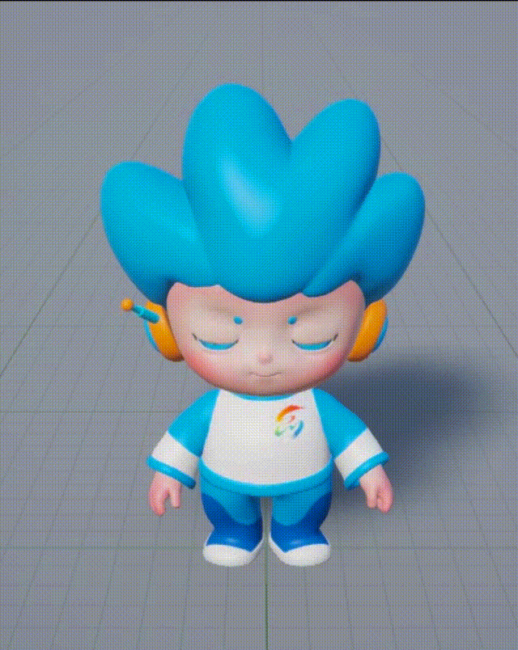
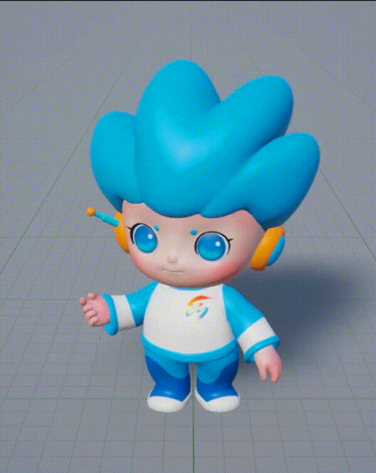
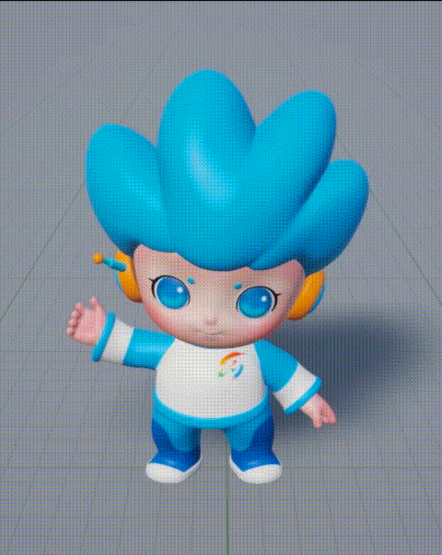
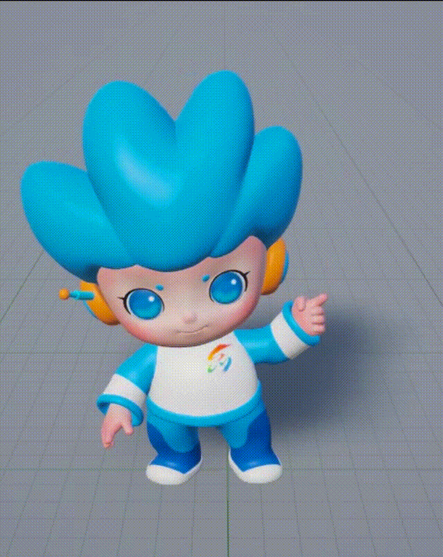
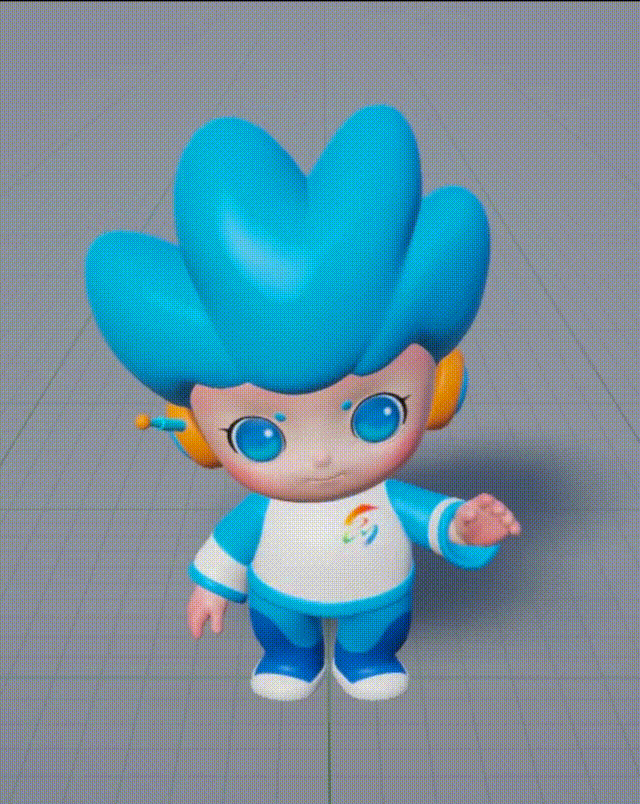
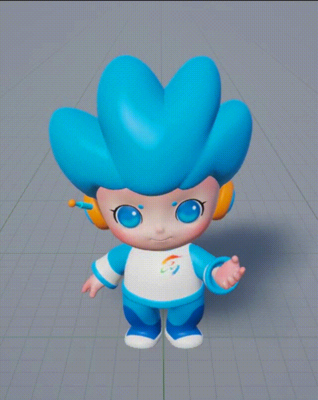

# 动画展示 | Animation Overview

以下为当前数字人的动画原型设计，包含待机、手势讲解、招手与展示等动作。

<table border="1" cellspacing="0" cellpadding="6" align="center" width="100%">
  <tr>
    <th style="text-align:center; background-color:#f2f2f2;" width="20%">动画名称 Animation</th>
    <th style="text-align:center; background-color:#f2f2f2;" width="40%">预览 Preview</th>
    <th style="text-align:center; background-color:#f2f2f2;" width="40%">描述 Description</th>
  </tr>

  <tr>
    <td align="center">待机 Idle</td>
    <td align="center"></td>
    <td align="center">数字人保持自然的待机姿势 The avatar remains in a natural idle pose.</td>
  </tr>

  <tr>
    <td align="center">双手讲解 Two-hand Explain</td>
    <td align="center"></td>
    <td align="center">数字人使用双手进行说明或演讲动作 The avatar explains using both hands.</td>
  </tr>

  <tr>
    <td align="center">右手讲解 Right-hand Explain</td>
    <td align="center"></td>
    <td align="center">数字人单手（右手）做讲解动作 The avatar explains using the right hand.</td>
  </tr>

  <tr>
    <td align="center">左手讲解 Left-hand Explain</td>
    <td align="center"></td>
    <td align="center">数字人单手（左手）做讲解动作 The avatar explains using the left hand.</td>
  </tr>

  <tr>
    <td align="center">左手招手-打招呼 Left-hand Wave</td>
    <td align="center"></td>
    <td align="center">数字人友好地招手打招呼 The avatar waves as a greeting.</td>
  </tr>

  <tr>
    <td align="center">左右手展示 Hand Show</td>
    <td align="center"></td>
    <td align="center">数字人张开双手进行展示 The avatar presents by spreading both hands.</td>
  </tr>

</table>

 
