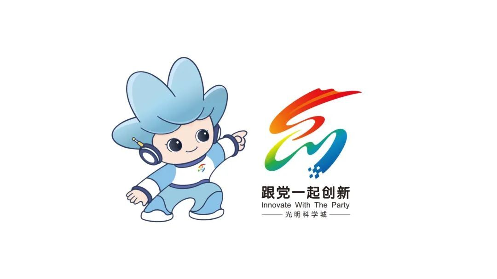

# 光明科学城形象整体介绍  

光明科学城

收到全国各地

120位设计师的167幅作品

经过两轮评选

符合光明科学城创新精神的LOGO和吉祥物正式发布！

首先

让我们一睹崭新的LOGO形象~

## LOGO 介绍  

  

标识由上方“G”与下方“M”构成（代表“光明”），包含光明科学城（GuangMing Science City）的英文首字母，暗含“光明人才”的寓意。  

配色采用 **红、绿、蓝**：  
- 红色部分：神似蜿蜒的网红景点光明虹桥
- 绿色部分：神似美丽的深圳茅洲河、公园之区
- 蓝色部分：代表光明科学城一大批科研机构、科技企业

标识整体形似“**创**”的草书，又似“**创新**”英文字母（Innovate）的变形，艺术化地表达了创新氛围。  

## 吉祥物介绍

  

吉祥物 **“光墩墩”** 形象活泼可爱，积极向上，富有亲和力，凝聚了科学城建设者的精神风貌。  

## 创新主题 

创新是光明科学城的一张闪亮名片

光明科学城因创新而绽放光彩

一起创新

一起奋斗

一起成长

原文链接：[光明科学城LOGO和吉祥物正式发布](https://m.mp.oeeee.com/a/BAAFRD000020230630814389.html?wxuid=ogVRcdBVoHZ5fLJjLwdN0aiRwB-A&wxsalt=4e03d6)