# 数字人导入 UE 教程
本文档说明如何将数字人模型导入 **Unreal Engine (UE)**，并完成动画、蓝图与关卡集成。包含模型准备、动画规范、蓝图组件配置、动画蓝图改造、关卡复用与测试等。

## 1. 准备工作
- **目标形象**：提供人物目标形象 **三视图**（可用 AI 生成或由设计师绘制）。  
- **动作参考**：给出**明确**的动作参考，与动画师对齐需求。  
- **基础动画**：至少准备 **1 个 Idle（待机）** 动画；建议再准备 **4 个 Talking** 动画。  

  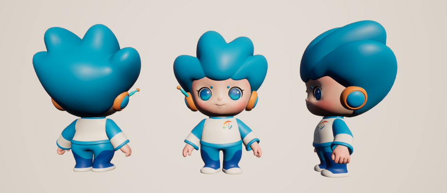 
  （模型与三视图示例 / 需求确认流程示例）

## 2. 动画制作规范
### Talking 动画触发逻辑
- 回答音频播放期间，后端**每隔 4 秒**向 UE 发送一次 `aniplay` 信号；  
- 动画蓝图收到信号后**随机**播放一个 Talking 动画；  
- **时长要求**：每条 Talking 动画 **4 秒**；建议**前 2–3 秒**为动作段，**剩余时长**用 Idle 动画平滑填充。  

  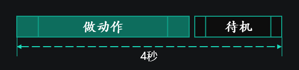 
  （Talking 触发逻辑与 Idle 循环示例）

### Idle 动画要求
- Idle **必须包含眨眼**，可酌情加入表情动画；  
- **头发、衣服**需随动作自然摆动；  
- **最后一帧需与第一帧重合**，保证循环无缝衔接。  

## 3. 嘴型与导出要求
- **嘴型绑定**：绑定 **13 个 blend shape**（可参考外部示例视频：[视频教程](https://www.bilibili.com/video/BV1pu41187ec/)）。  
- **FBX 导出**：最终 FBX 应包含 **模型 + 13 个 blend shape + 身体骨骼**；细节可参考 `Dun.rar`。  

  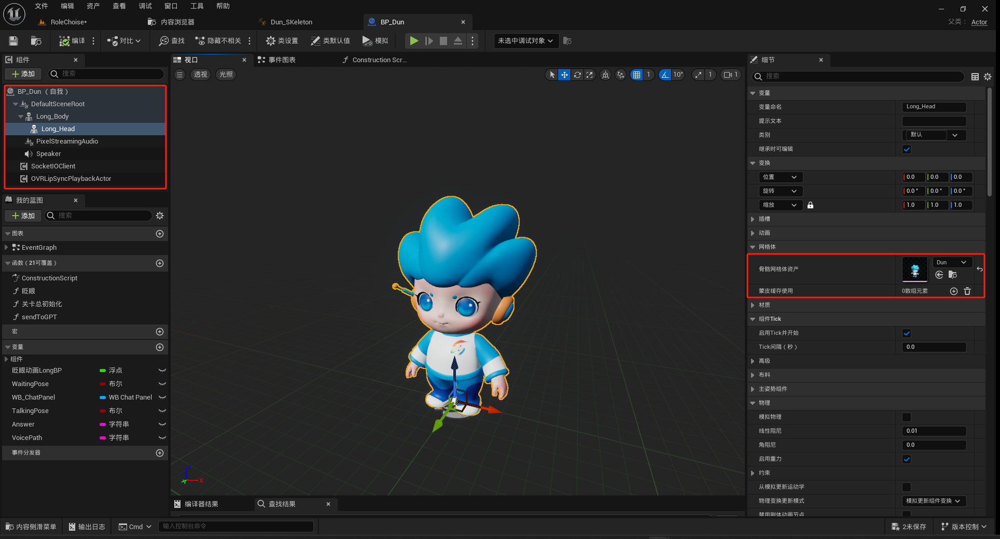 
  （修改内容导览）

## 4. 项目改动与蓝图组件
1. 参考 **DunDun** 创建蓝图类 **`BP_XXX`**；  
2. 为角色添加以下组件：  
   - `PixelStreamingAudio`  
   - `SocketIOClient`  
   - `OVRLipSyncPlaybackActor`  
3. 在 **`Long_Head`** 细节面板中**导入骨骼网络体资产**；  
4. 在 **`SocketIOClient`** 中配置与外部服务的 **Address** 与 **Port**。  

  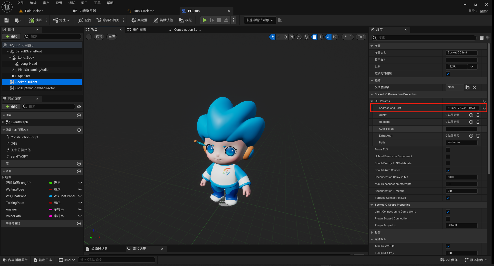 
  （组件与网络服务端口示例）

## 5. 事件图表与关卡切换
- **事件图表（Event Graph）逻辑可直接复用**；  
- 由于各动画**自带眨眼**，可**删除独立的眨眼蓝图类**；  
- 当前包含 **2 个 Level 切换** 方案：  
  - 将新增角色替换到现有 **Girl / DunDun** 中；  
  - 或通过**新角色管家**直接进入。  

  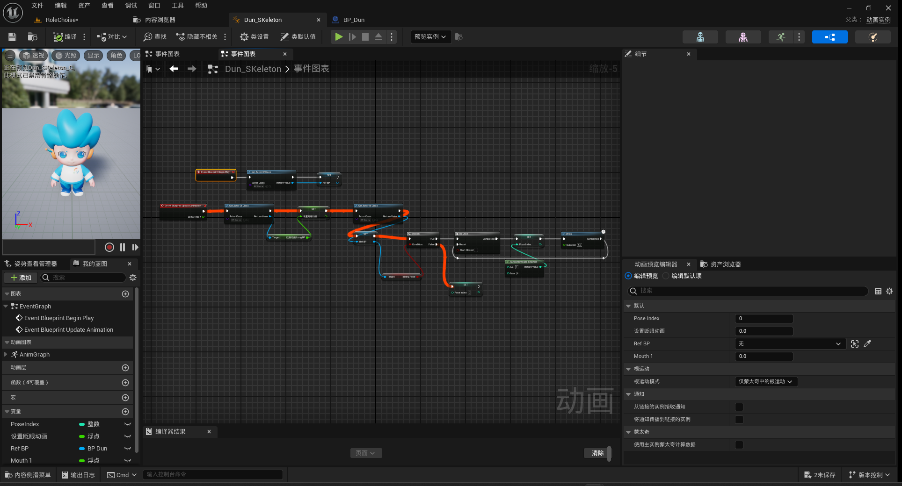 
  （事件图表复用与多 Level 切换结构示意）

## 6. 动画蓝图（AnimBP）创建与节点调整
1. **创建/复制**动画蓝图，**复用既有事件图表**；  
2. 将 `Get Actor Of Class` 节点中的 **Actor Class** 更换为**新角色类**；  

  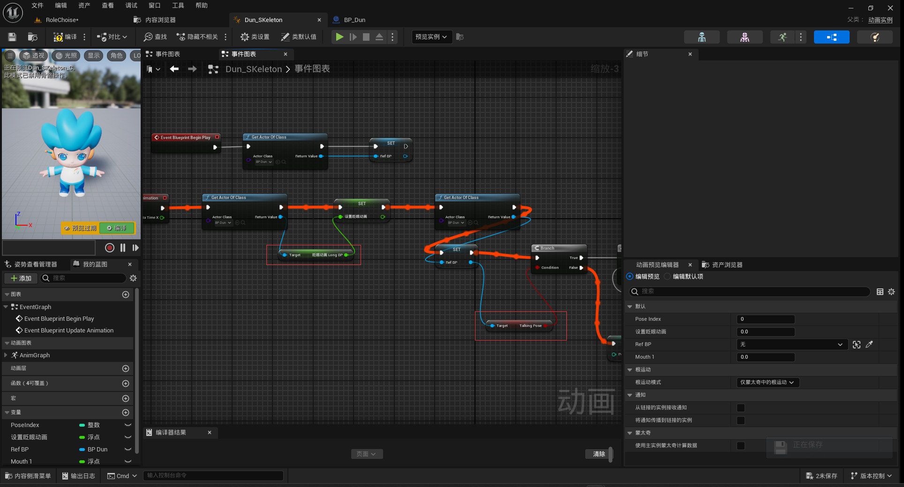 

  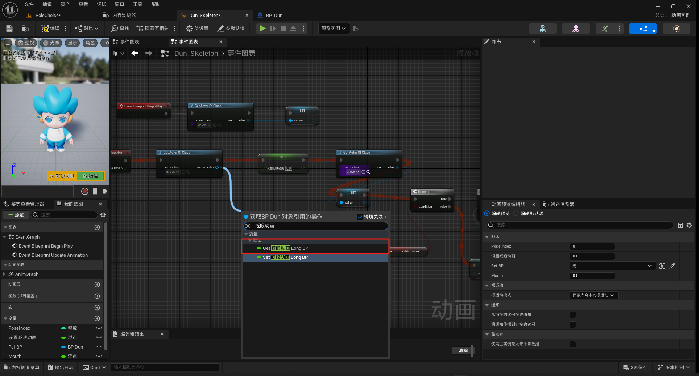 
  （ 替换与节点重连示例）

3. **删除**原有的 **两个传递任务**（legacy 节点）；  
4. 自 `Get Actor Of Class` 重新**新增节点**，并完成以下替换：  
   - 眨眼动画（Blink）相关节点；  
   - `Talking Pose` 的 `Get` 任务等节点；  
5. 点击 **Compile（编译）**，按提示**创建缺失节点**。  

  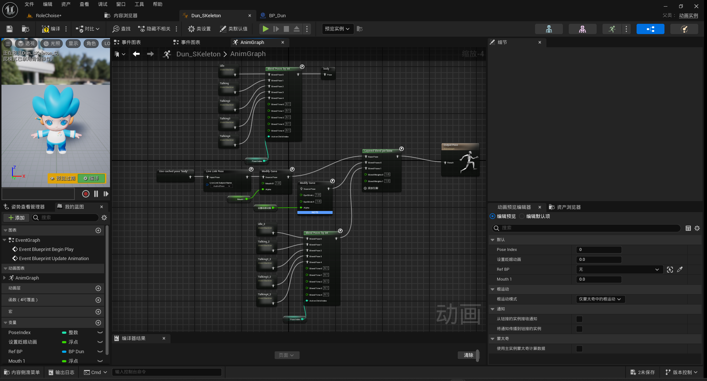 
  （动画蓝图节点替换示例）

## 7. 状态机与动画替换
- 在动画蓝图中**复用**现有**动画图表**内容；  

  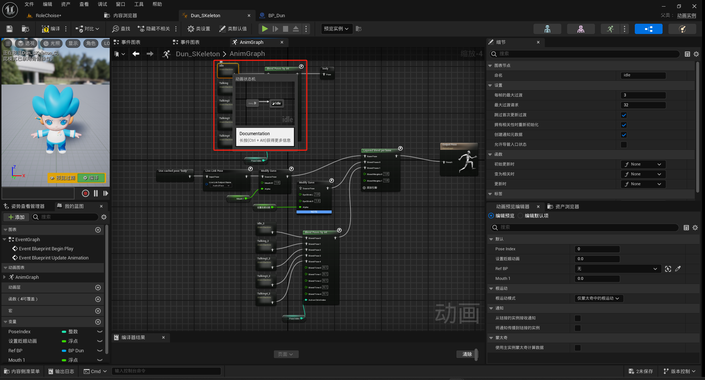 
  （复用现有动画）

- 双击进入**状态机 / 状态序列**，逐一将状态中的动画**替换为新角色动画**；  
- 依次替换并核对各 **Talking** 动作，保证与第 2 节的**时长与触发规则**一致。  

  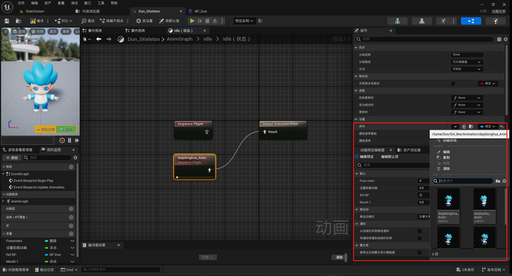 
  （状态机与各状态动画替换流程）

## 8. 关卡复用与部署
- 复用 **DunDun / Girl** 的关卡；  
- 将新建的 **`BP_XXX`** 拖入关卡，放置到合适位置；  
- **激活关卡**并联调 Talking 触发与 Idle 循环，完成测试与交付。  

  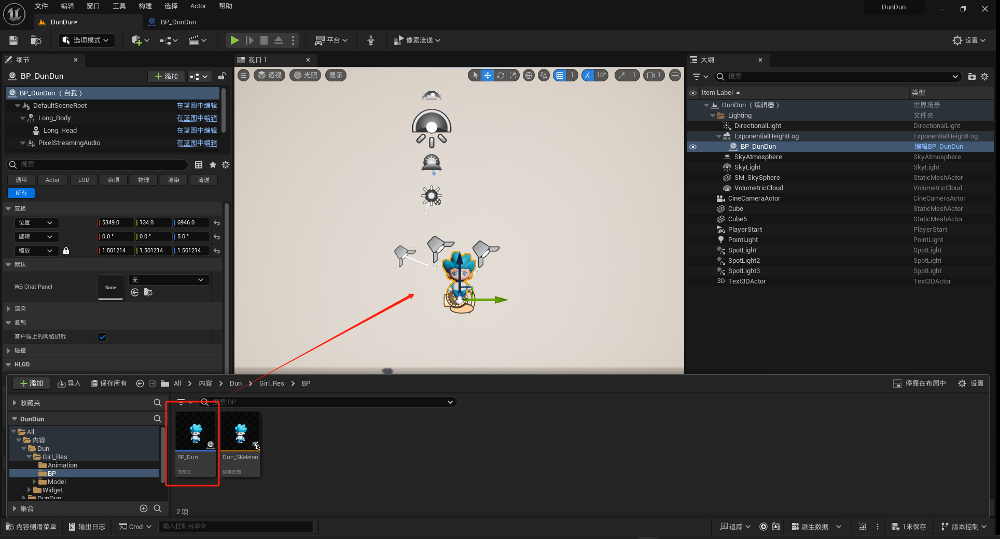 
  （关卡布置与联调要点）

